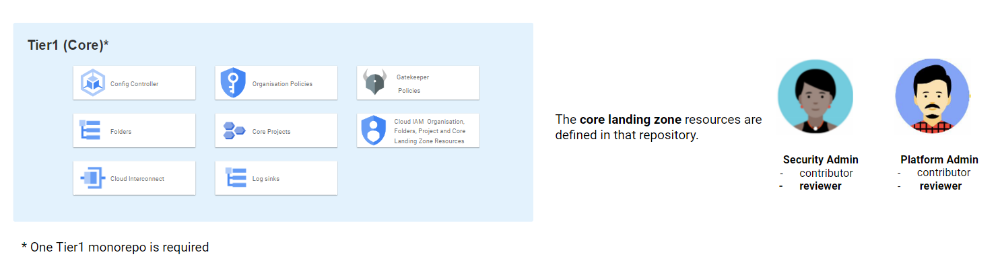
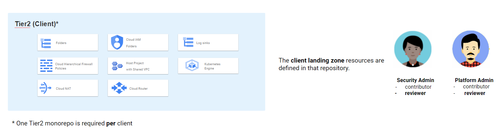
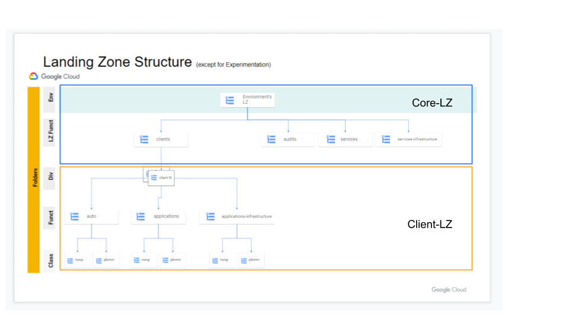

# GCP PubSec Declarative Toolkit

The GCP PubSec Declarative Toolkit is a collection of declarative solutions to help you on your Journey to Google Cloud. Solutions are designed using [Config Connector](https://cloud.google.com/config-connector/docs/overview) and deployed using [Config Controller](https://cloud.google.com/anthos-config-management/docs/concepts/config-controller-overview).

Solutions and Services
=======================

What is a Solution
------------------

Solutions are made up of [KRM](https://kubernetes.io/docs/concepts/overview/working-with-objects/kubernetes-objects/) (Kubernetes Resource Model) KCC files that uses the [kpt](https://kpt.dev) method of packaging and deploying these resources. A solution is typically made up of a collection of cloud resources that once created are fully configured and running.

Solutions may contain templated KCC services.

What is a Service
------------------

We define a service as a reusable / repeatable package that is more find grained then a complete packaged solution. For example: we have created a Bastion Host service that uses best practices. Services are `kpt` packages that can be pulled into your solution as a sub-package, this sub-package method allows for separation of updating the core solution and the services.

## Getting Started

## Repos Definitions and Roles

 Shared Services Canada (SSC) adopted the [monorepo](https://monorepo.tools/) structure for repositories. Monorepos are great for managing multiple solutions inside a single repository.

The diagrams below show all the repositories **types** and the **roles** that are granted to teams for each one of them.

### Tier1

### Tier2

### Tier34

### Current Landing Zone

This current Landing Zone is a result of deploying the solutions in tier1 and tier2 folders setup under the solutions folder.

### Deploying an example landing zone requires two steps:
- A [Config Connector](https://cloud.google.com/config-connector/docs/overview) enabled Kubernetes cluster
- One or more [solutions](#current-solutions) packages like the [core-landing-zone](solutions/core-landing-zone) and [experimentation core-landing-zone](solutions/experimentation/core-landing-zone) documented in section 2 of [landing-zone-v2](docs/landing-zone-v2#2-create-your-landing-zone)

In order to deploy the [solutions](#current-solutions) you will need a Kubernetes cluster with [Config Connector](https://cloud.google.com/config-connector/docs/overview) installed.

We recommend using the Managed Config Controller service which comes bundled with [Config Connector](https://cloud.google.com/config-connector/docs/overview) and [Anthos Config Management](https://cloud.google.com/anthos/config-management), alternatively you can [install](https://cloud.google.com/config-connector/docs/how-to/advanced-install#manual) Config Connector on any CNCF compliant Kubernetes cluster.

See the Google Cloud [quickstart](https://cloud.google.com/anthos-config-management/docs/tutorials/manage-resources-config-controller) guide for getting up and running with Config Controller

## Implementation

Navigate to the following [guide](docs/advanced-install.md) to deploy a standalone Config Controller instance or see the examples [directory](examples/) for example installation methods.

After the Kubernetes cluster is fully provisioned - proceed to [Deploy a landing zone v2 package](docs/landing-zone-v2/README.md).

OR 
Use automated scripts to deploy landing zone [scripts](docs/scripts/README.md)

## Additional Documentation

You may want to look at the [documentation](https://github.com/ssc-spc-ccoe-cei/gcp-documentation) published by **[Shared Services Canada](https://www.canada.ca/en/shared-services.html)**, providing a good level of details on how they have implemented the [Landing Zone v2 solution](docs/landing-zone-v2/README.md) to host workloads from any of the 43 departments of the Government of Canada.

For further documentation on the project, including the setup pre-requirements and supporting service such as Config Connector and Config Management.

- [Multi-Tenancy](https://cloud.google.com/anthos-config-management/docs/tutorials/project-namespace-blueprint)
- [Scalability Guidelines](https://cloud.google.com/anthos-config-management/docs/concepts/config-controller-scalability)
- [View Config Controller Status](https://cloud.google.com/anthos-config-management/docs/how-to/config-controller-repo-status)
- [Monitor Resources](https://cloud.google.com/config-connector/docs/how-to/monitoring-your-resources)
- [Config Connector Resources](https://cloud.google.com/config-connector/docs/reference/overview)
- [Config Connector OSS on GitHub](https://github.com/GoogleCloudPlatform/k8s-config-connector)
- [Known Issues](docs/issues.md)
- [Fleet Management at Spotify (Part 2): The Path to Declarative Infrastructure](https://engineering.atspotify.com/2023/05/fleet-management-at-spotify-part-2-the-path-to-declarative-infrastructure/)

## Additional Resources

- [Awesome KRM](https://github.com/askmeegs/learn-krm)
- [I do declare! Infrastructure automation with Configuration as Data](https://cloud.google.com/blog/products/containers-kubernetes/understanding-configuration-as-data-in-kubernetes)
- [Rationale Behind kpt](https://kpt.dev/guides/rationale)
- [KRM Blueprints](https://github.com/GoogleCloudPlatform/blueprints)
- [How Goldman Sachs manages Google Cloud resources with Anthos Config Management at Google Next](https://www.youtube.com/watch?v=5ENId064XLo)

## Disclaimer

This is not an officially supported Google product.
