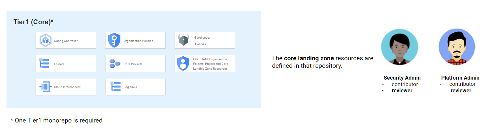
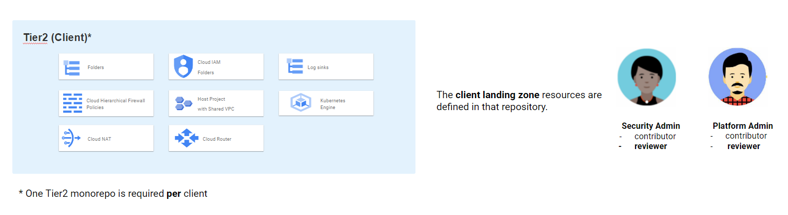
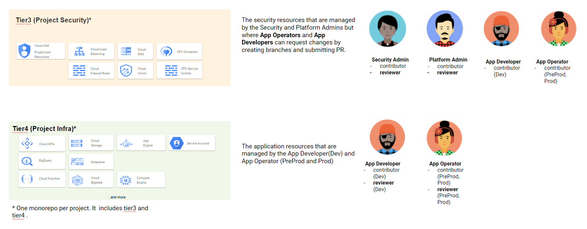
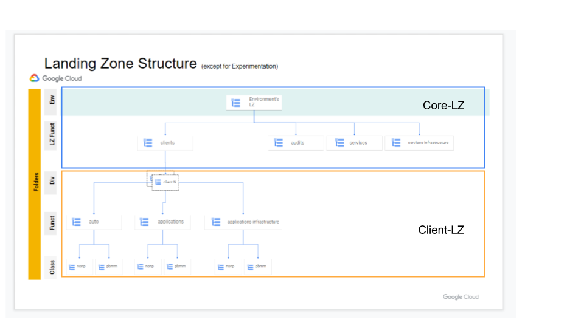
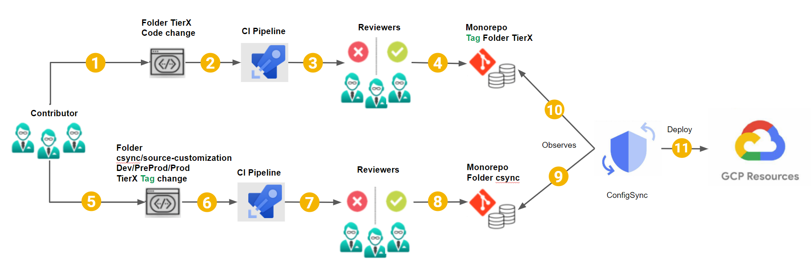
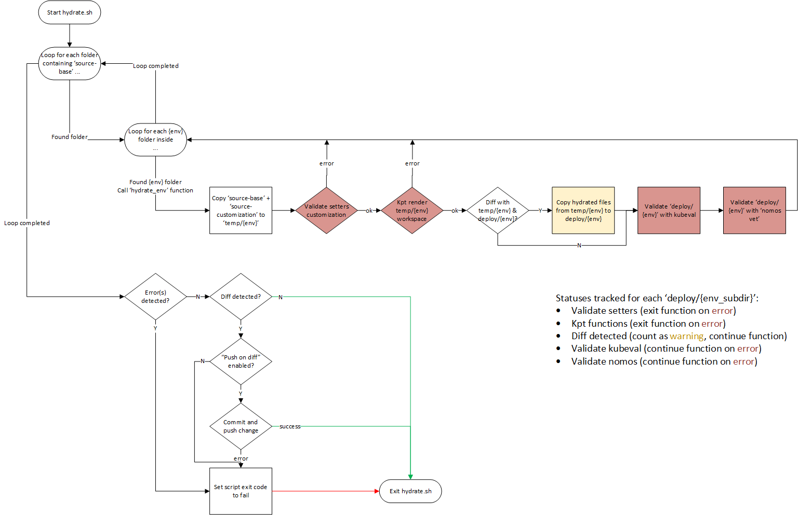

# Repository Structure

- [Repository Structure](#repository-structure)
  - [Repos Definitions and Roles](#repos-definitions-and-roles)
    - [Tier1](#tier1)
    - [Tier2](#tier2)
    - [Tier34](#tier34)
  - [Gitops](#gitops)
  - [Git](#git)
  - [Deployment Repos](#deployment-repos)
    - [Git Submodule: `tools`](#git-submodule-tools)
    - [Hydration Process](#hydration-process)
  - [Versioning](#versioning)

## Repos Definitions and Roles

SSC adopted the [monorepo](https://monorepo.tools/) structure for repositories. Monorepos are great for managing multiple solutions inside a single repository.

The diagrams below show all the repositories **types** and the **roles** that are granted to teams for each one of them.

### Tier1



### Tier2



### Tier34



### Current Landing Zone



This current Landing Zone has the tier1 and tier2 configuration when you deploy core-landing-zone and client-landing-zone setup under the solutions folder.

### Understanding RootSync and RepoSync
Root-Sync & Repo-Sync
In a multi-team environment, if you want to manage all of the teams, the root-sync is the one handling the landing zone deployment, which means their is going to be a root repository and will be syncing up from there. Within the root-sync you can then have a repo-sync (various namespaces) that the teams can use and you can fine grain the permissions limiting what is allowed.

Multi-tenancy comes out of box when using KCC, which is one of its advantages.

The gatekeeper is what's powering the constraints like data location constraints to a particular region. 
apiVersion: constraints.gatekeeper.sh/vbeta1
Do "kubectl get constraints" to see these contraints


## Gitops

The current solution is using [Config Sync](https://cloud.google.com/anthos-config-management/docs/config-sync-overview) with git repos to pull configurations for deploying GCP infrastructure.

The diagram below describes the Gitops process.



The process to implement a code change goes like this:

1. The contributor will create a branch and make code changes in a tierX folder of the monorepo and open a pull request.
2. The CI process validates the change.
3. The reviewers can approve or deny the PR.
4. Once the pull request is completed, the branch is merged into the main branch and a new git tag specifying a new version is created for the affected tierX folder.
5. The contributor will create a branch and modify the tag value in the folder csync/source-customization/`env`/tierX by setting it to the new version that got created in step 4.
6. The CI process validates the change.
7. The reviewers can approve or deny the PR.
8. Once the pull request is completed, the branch is merged into the main branch **but** this time, **no** new tag is created.
9. The ConfigSync operator running in Config Controller which is already observing `HEAD` for the csync folder will pickup the new commit.
10. It will start observing that new version of the tierX folder.
11. It deploys resources accordingly in GCP.
 &nbsp;

## Git

The git repos are organized in different categories:

- `gcp-blueprints-catalog` **private repo** contains SSC specific packages that are used to build a landing zone.
- `gcp-documentation` (this repo) contains documentation for the landing zone.
- `gcp-tools` contains common scripts and pipeline templates used as a git submodule by deployment repos below.

- Deployment monorepos:
  - `gcp-experimentation-tier1` contains all the experimentation resources.
  - `gcp-env-tier1` contains the core level resources for dev, preprod and prod.
  - `gcp-<client-name>-tier2` contains the client level resources for dev, preprod and prod.
  - `gcp-<x-project-id>-tier34` contains the security and application resources for dev, preprod and prod.
                                You need to replace the environment-code of the project-id with character "x" as this repo will contain the configuration for all environments. This only applies to the repo name. Do not use x as the environment code for your project-id in the `setters.yaml` as this will trigger a Gatekeeper validation error: `admission webhook "validation.gatekeeper.sh" denied the request` !!!**

## Deployment Repos

These monorepos have a common directory structure with slight variations.

Below is a brief explanation of key repo components.  Some directories include sub-directories for each environment it configures (experimentation, dev, preprod, prod).  For simplicity, they will be expressed below as `<env_subdirs>`.

```text
repo-root/
├── .azure-pipelines or .github : pipelines YAML files.
├── bootstrap/: (only in the "tier1" repos)
│   ├── <env_subdirs>/: contains `.env` file needed to create the management project which includes the Config Controller GKE cluster.
                        It also include the initial root-sync.yaml file that has been generated by the setup-kcc.sh script.
├── csync/
│   ├── deploy/: ("WET" folder) its content is automatically generated and must not be edited manually.
│   │   ├── <env_subdirs>/: contains the hydrated YAML files to be deployed.  **This is the directory observed by Config Sync.**
│   ├── source-base/: ("DRY" folder) contains a root-sync package that will be deployed to all environments.
│   ├── source-customization/
│   │   ├── <env_subdirs>/: contains the customization files that will overwrite the base for the environment.  Directory and file names must be replicated.
│                           To customize `source-base/root-sync-git/setters.yaml`, it should be copied, then edited, in `source-customization/<env_subdir>/root-sync-git/setters.yaml`.
├── tierX/
│   ├── deploy/: ("WET" folder) its content is automatically generated and must not be edited manually.
│   │   ├── <env_subdirs>/: contains the hydrated YAML files to be deployed.  **This is the directory observed by Config Sync.**
│   ├── source-base/: ("DRY" folder) contains a collection of *unedited* packages that will be deployed to all environments.
│   ├── source-customization/
│   │   ├── <env_subdirs>/: contains the customization files that will overwrite the base for the environment.  Directory and file names must be replicated.
│                           For example, to customize `source-base/core-landing-zone/setters.yaml`, it should be copied,
│                           then edited, in `source-customization/<env_subdir>/core-landing-zone/setters.yaml`.
├── tools/: git submodule from [gcp-tools](https://github.com/ssc-spc-ccoe-cei/gcp-tools)
├── modupdate.sh: script to checkout the git submodules, i.e. tools.
├── modversions.yaml: file used by modupdate.sh to specify which versions of git sub modules to checkout.
├── version-tagging-config.json
```

Here are the links to the repositories templates for each deployment repos:

- [gcp-tier1-template](https://github.com/ssc-spc-ccoe-cei/gcp-tier1-template)
- [gcp-tier2-template](https://github.com/ssc-spc-ccoe-cei/gcp-tier2-template)
- [gcp-tier34-template](https://github.com/ssc-spc-ccoe-cei/gcp-tier34-template)

### Git Submodule: `tools`

As mentioned above, the [gcp-tools](https://github.com/ssc-spc-ccoe-cei/gcp-tools) repo is configured as a git submodule in `.gitmodules`.  This git configuration is limited to specifying a branch.

To overcome this limitation and checkout a specific tag or commit SHA, run `modupdate.sh` to checkout the version configured in `modversions.yaml`.

### Hydration Process

The tools submodule contains a `hydrate.sh` script to hydrate the configs with `kpt`.  The script must be executed when any changes to `source-base` and/or `source-customization` are made.  It can be executed locally or in a pre-commit hook and also in a validation pipeline during PR creation.

At a high level, the script will:

1. Find properly stuctured 'deploy', 'source-base' and 'source-customization' directories, then for each environment (experimentation, dev, preprod, prod), check if `source-customization/` contains that sub directory.  If so:
    - Create a `temp-workspace/<env>` directory to copy the `source-base/` and then copy `source-customization/<env>/`, this adds customization specific to that environment.
    - Validate that setters file(s) are customized.
    - Run `kpt fn render` and remove local configs in `temp-workspace/<env>`.
    - Check if newly hydrated files in `temp-workspace/<env>` are different than `deploy/<env>`.  If so, copy them to `deploy/<env>`.
    - Validate rendered files in `deploy/<env>` with `kubeval` and `nomos vet`.
1. If no errors are found and changes are detected, optionally push to the branch or exit the script with failure.
A failure ensures proper behavior when running from a pre-commit hook or a pipeline.



## Versioning

It is good practice to pin a repo and folder reference to a specific commit using tags or commit SHA.

A version tagging pipeline can be used to increment a folder's version with git tags.  Samples can be found in the [gcp-tools](https://github.com/ssc-spc-ccoe-cei/gcp-tools/tree/main/pipeline-samples/version-tagging) repo.

Alternatively, the commit SHA can be used.  Although not as intuitive as tags, it is considered more secure.
