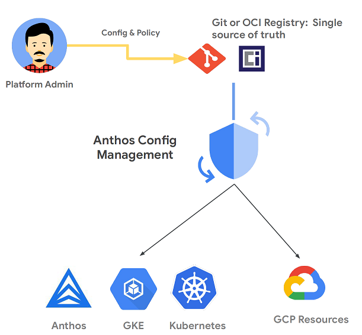
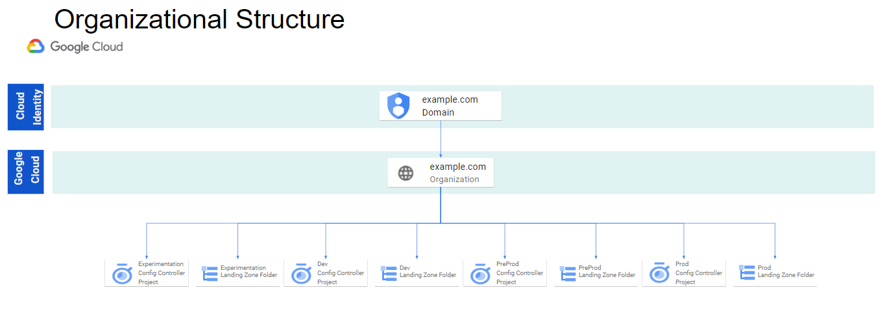

# KRM Landing Zone v2

## Table of Contents
<!-- vscode-markdown-toc -->
- [KRM Landing Zone v2](#krm-landing-zone-v2)
  - [Table of Contents](#table-of-contents)
  - [Introduction](#introduction)
  - [Implementation](#implementation)
  - [Organization](#organization)
  - [Single GCP organization](#single-gcp-organization)
  - [Multiple GCP organizations](#multiple-gcp-organizations)
  - [Folder Structure Per Environment (Dev, Preprod, Prod)](#folder-structure-per-environment-dev-preprod-prod)
    - [Core Landing Zone](#core-landing-zone)
    - [Client Landing Zone](#client-landing-zone)
  - [Setup](#setup)
    - [1. Complete the bootstrap procedure](#1-complete-the-bootstrap-procedure)
      - [Requirements](#requirements)
    - [Summary](#summary)
    - [Initial Organization configuration](#initial-organization-configuration)
  - [Config Controller project and cluster](#config-controller-project-and-cluster)
    - [Option 1 - Org level folder](#option-1---org-level-folder)
    - [Option 2 - Folder in a Folder](#option-2---folder-in-a-folder)
    - [Option 1 - Org level Project](#option-1---org-level-project)
    - [Option 2 - Project in a Folder](#option-2---project-in-a-folder)
    - [GKE Autopilot - Fully managed cluster](#gke-autopilot---fully-managed-cluster)
    - [GKE Standard](#gke-standard)
    - [GKE Credentials](#gke-credentials)
    - [GKE Service Account](#gke-service-account)
  - [2. Create your landing zone](#2-create-your-landing-zone)
    - [Fetch the packages](#fetch-the-packages)
    - [2b. Deploy the infrastructure using KPT](#2b-deploy-the-infrastructure-using-kpt)
      - [gatekeeper-policies](#gatekeeper-policies)
      - [core-landing-zone](#core-landing-zone-1)
  - [3. Deploy the infrastructure using GitOps](#3-deploy-the-infrastructure-using-gitops)
    - [Create a new repository in your Repo Hosting Solution (Github, Gitlab or Azure Devops)](#create-a-new-repository-in-your-repo-hosting-solution-github-gitlab-or-azure-devops)
    - [ConfigSync](#configsync)
  - [4. Validate the landing zone deployment](#4-validate-the-landing-zone-deployment)
  - [5. Perform the post-deployment steps](#5-perform-the-post-deployment-steps)
    - [Grant billing account user role](#grant-billing-account-user-role)
  - [Next Step](#next-step)
  - [Clean Up](#clean-up)
  - [GitOps](#gitops)

## <a name='Introduction'></a>Introduction

This solution uses [Config Controller](https://cloud.google.com/anthos-config-management/docs/concepts/config-controller-overview) to deploy and manage the GCP infrastructure.

Config Controller is a hosted service to provision and orchestrate Anthos, GKE, Kubernetes and Google Cloud resources. It offers an API endpoint that can provision, actuates, and orchestrates Google Cloud resources as part of Anthos Config Management.



This Landing Zone v2 differentiates from the `solutions/landing-zone` mostly because it provides flexibility by allowing you to select the sub-packages variants that best fit your requirements. It also uses multiples least privilege **Core** GCP service accounts which are linked to distinct kubernetes namespaces using workload identity.

## <a name='Implementation'></a>Implementation


You may want to look at the [documentation](https://github.com/ssc-spc-ccoe-cei/gcp-documentation) published by **Shared Services Canada**, providing a good level of details on how they have implemented this landing zone solution to host workloads from any of the 43 departments of the Government of Canada.

## <a name='Organization'></a>Organization

This Landing Zone v2 assumes that the different required environments known as Experimentation, Development, PreProduction and Production are all instantiated with their own landing zone. This can be achieved with a single GCP organization and multiple landing zone folders representing the environments OR by using multiple GCP organizations.

## <a name='SingleGCPorganization'></a>Single GCP organization

This pattern will be ideal for most use-cases and isolation between environments is achieved through folder structures.

In this example a Landing Zone is deployed per environment.



## <a name='MultipleGCPorganizations'></a>Multiple GCP organizations

This pattern is ideal for Departments who need a higher degree of isolation between environments by using Google Cloud Organizations as the environment boundary vs using folders.

Additional details about using multiple organizations can be found [here](https://cloud.google.com/resource-manager/docs/managing-multiple-orgs).


## <a name="folderStructure"></a>Folder Structure Per Environment (Dev, Preprod, Prod)

A deployed Landing Zone contains two sections the Core Landing Zone and the Client Landing Zone. Together they will deploy a structure that matches the diagram below.


### Core Landing Zone

This is made up of two packages [core-landing-zone](../../solutions/core-landing-zone/) and [gatekeeper-policies](../../solutions/gatekeeper-policies/). This section provides the core of the landing zone functionality with Logging, Org Policies, and Shared Infrastructure like DNS and a Shared VPC (coming soon) as well as compliance enforcement in Config Controller.

This can be deployed once or multiple times per organization as highlighted in the diagrams below.

| Folder | Usage |
| --- | --- |
| clients | Contains client resources |
| audits | Contains the landing zone logging project |
| services | Contains service projects for applications that are offered as a services (AD, Backup, Trusted Images, Artifact registry, Certificate Authority, etc.) to all clients |
| services-infrastructure | Contains the shared hub networking project, the core dns project as well as the host project for additional services |

### Client Landing Zone

This section is made up of two packages [client-setup](../../solutions/client-setup/) and [client-landing-zone](../../solutions/client-landing-zone/). The client setup package prepares the Config Controller instances for the new client and creates the required service accounts and namespaces for the client to use.

The `client-landing-zone` package deploys the clients Google Cloud resources, including folder structure, firewalls, and Shared Infrastructure (VPC). The deployment of these packages are repeated for each onboarded client. A client in these examples would be an a department or working group that needs isolation from other groups.

It is possible to only have 1 client and service multiple teams and working groups. In this case teams would have folders or projects created under the `applications`, `auto` and/or `applications-infrastructure` folders that are created in the `client-landing-zone` deployment.

| Folder | Usage |
| --- | --- |
|auto | Contains projects related to automation tools such as CI and CD pipelines |
| applications (pbmm/nonp) | Contains application’s service projects |
| applications-infrastructure | Contains the networking project, that are used to host applications |


## <a name='Setup'></a>Setup


To deploy this Landing Zone you will need to:

  1. [Complete the bootstrap procedure.](#1-complete-the-bootstrap-procedure)
  2. [Create your landing zone.](#2-create-your-landing-zone)
  3. [Deploy the infrastructure using gitops](#deploy-the-infrastructure-using-gitops)
  4. [Validate the landing zone deployment](#4-validate-the-landing-zone-deployment)
  5. [Perform the post deployment steps](#5-perform-the-post-deployment-steps)

### <a name='Completethebootstrapprocedure'></a>1. Complete the bootstrap procedure

#### <a name='Requirements'></a>Requirements

1. Cloud identity has been deployed
1. GCP IAM permissions for the account executing this procedure:
   - Org level:
      - Organization Admin
      - Folder Admin
      - Project IAM Admin
      - Compute Network Admin
      - Access Context Manager Admin
      - Service Directory Editor
      - DNS Administrator
      - Logging Admin
   - Billing account:
      - Billing admin

    ```shell
    gcloud organizations add-iam-policy-binding $ORG_ID --member=user:$SUPER_ADMIN_EMAIL --role=roles/resourcemanager.organizationAdmin --quiet
    gcloud organizations add-iam-policy-binding $ORG_ID --member=user:$SUPER_ADMIN_EMAIL --role=roles/resourcemanager.folderAdmin --quiet
    gcloud organizations add-iam-policy-binding $ORG_ID --member=user:$SUPER_ADMIN_EMAIL --role=roles/resourcemanager.projectIamAdmin --quiet
    gcloud organizations add-iam-policy-binding $ORG_ID --member=user:$SUPER_ADMIN_EMAIL --role=roles/compute.networkAdmin --quiet
    gcloud organizations add-iam-policy-binding $ORG_ID --member=user:$SUPER_ADMIN_EMAIL --role=roles/accesscontextmanager.policyAdmin
    gcloud organizations add-iam-policy-binding $ORG_ID --member=user:$SUPER_ADMIN_EMAIL --role=roles/servicedirectory.editor --quiet
    gcloud organizations add-iam-policy-binding $ORG_ID --member=user:$SUPER_ADMIN_EMAIL --role=roles/dns.admin --quiet
    gcloud organizations add-iam-policy-binding $ORG_ID --member=user:$SUPER_ADMIN_EMAIL --role=roles/logging.admin --quiet
    ```

1. Software
    - [Google Cloud SDK version >= 429.0.0](https://cloud.google.com/sdk/docs/downloads-versioned-archives)
    - [kpt](https://kpt.dev/installation/kpt-cli?id=gcloud)
    - [nomos](https://cloud.google.com/anthos-config-management/docs/how-to/nomos-command#installing)
    - [kubectl](https://kubernetes.io/docs/tasks/tools/) ( >= v1.20)

### <a name='Summary'></a>Summary

- Initial Organization configuration.
- A GCP folder to host the landing zone hierarchy.
- A config controller project.
- A VPC, a subnet and a Cloud NAT.
- Private Service Connect to access googleapis.com and gcr.io
- VPC firewall rules.
- A config controller cluster.
- IAM permission for the "Yakima" service account.

### <a name='InitialOrganizationconfiguration'></a>Initial Organization configuration

The following instructions in this section 1 for the boostrap of the Config Controller project and cluster are fully automated in the [setup-kcc.sh](https://github.com/ssc-spc-ccoe-cei/gcp-tools/blob/main/scripts/bootstrap/setup-kcc.sh) script.

1. Define environment variables

    ```shell
    export CLUSTER=<cluster-name>
    export REGION=northamerica-northeast1
    export PROJECT_ID=<project-id>
    export LZ_FOLDER_NAME=<env>-<landing zone name>
    export NETWORK=<vpc-name>
    export SUBNET=<subnet-name>
    export ORG_ID=<your_org_id>
    export ROOT_FOLDER_ID=<your_folder_id> # This one is only required if not deploying at the org level. Ex. for testing. See option 2 when executing the Config Controller project and cluster below
    export BILLING_ID=XXXXX-XXXXX-XXXXX
    export GIT_USERNAME=<git username> # For Azure Devops, this is the name of the Organization
    export TOKEN=XXXXXXXXXXXXXXXXXXXXXXXXXXXXXXXXXXXXXXX
    ```

1. Set Default Logging Storage Location.

    This command will ensure that the default logging buckets that are generated with a new project (organization wide) are set to the selected region instead of the default location `global`.

    ```shell
    # Validate if a storageLocation is defined for the organization
    gcloud logging settings describe --organization=${ORG_ID}

    # Modify the default logging storage location
    gcloud logging settings update --organization=$ORG_ID --storage-location=$REGION
    ```

1. Create the Organization level Access Context Manager policy

    There can only be one organization level ACM policy per organization

    ```shell
    # Validate if an ACM policy exist
    gcloud access-context-manager policies list --organization=${ORG_ID}

    # To create an ACM policy that applies to the entire organization, run:
    gcloud access-context-manager policies create \
      --organization=organizations/${ORG_ID} --title="My Policy"
    ```

## <a name='ConfigControllerprojectandcluster'></a>Config Controller project and cluster

1. Create a folder where the Landing Zone will be deployed into:

### <a name='Option1-Orglevelfolder'></a>Option 1 - Org level folder

```shell
    FOLDER_ID=$(gcloud resource-manager folders create --display-name=$LZ_FOLDER_NAME --organization=$ORG_ID --format="value(name)" --quiet | cut -d "/" -f 2)
```

### <a name='Option2-FolderinaFolder'></a>Option 2 - Folder in a Folder

```shell
    FOLDER_ID=$(gcloud resource-manager folders create --display-name=$LZ_FOLDER_NAME  --folder=$ROOT_FOLDER_ID --format="value(name)" --quiet | cut -d "/" -f 2)
```

2. Create a new project at the org level where we will install the Config Controller instance.

### <a name='Option1-OrglevelProject'></a>Option 1 - Org level Project

```shell
    gcloud projects create $PROJECT_ID --set-as-default --organization=$ORG_ID
```

### <a name='Option2-ProjectinaFolder'></a>Option 2 - Project in a Folder

```shell
    gcloud projects create $PROJECT_ID --set-as-default --folder=$ROOT_FOLDER_ID
```

1. Enable Billing

```shell
    gcloud beta billing projects link $PROJECT_ID --billing-account $BILLING_ID
```

2. Set the project ID

    ```shell
    gcloud config set project $PROJECT_ID
    ```

1. Enable the required services to provision the config controller instance.

    ```shell
    gcloud services enable anthos.googleapis.com krmapihosting.googleapis.com container.googleapis.com cloudresourcemanager.googleapis.com cloudbilling.googleapis.com serviceusage.googleapis.com servicedirectory.googleapis.com dns.googleapis.com
    ```

1. Create the required network resources. Config Controller provisions a managed Private GKE instance and still requires some core networking resource to work.

    ```shell
    # VPC
    gcloud compute networks create $NETWORK --subnet-mode=custom

    # Subnet
    gcloud compute networks subnets create $SUBNET  \
    --network $NETWORK \
    --range 192.168.0.0/16 \
    --region $REGION \
    --stack-type=IPV4_ONLY \
    --enable-private-ip-google-access \
    --enable-flow-logs --logging-aggregation-interval=interval-5-sec --logging-flow-sampling=1.0 --logging-metadata=include-all

    # Cloud router and Cloud NAT
    gcloud compute routers create kcc-router --project=$PROJECT_ID  --network=$NETWORK  --asn=64513 --region=$REGION
    gcloud compute routers nats create kcc-router --router=kcc-router --region=$REGION --auto-allocate-nat-external-ips --nat-all-subnet-ip-ranges --enable-logging
    ```

1. Private Service Connect to access Google's API

    ```shell
    # enable logging for dns
    gcloud dns policies create dnspolicy1 \
    --networks=$NETWORK \
    --enable-logging \
    --description="dns policy to enable logging"

    # private ip for apis
    gcloud compute addresses create apis-private-ip \
    --global \
    --purpose=PRIVATE_SERVICE_CONNECT \
    --addresses=10.255.255.254 \
    --network=$NETWORK

    # private endpoint
    gcloud compute forwarding-rules create endpoint1 \
    --global \
    --network=$NETWORK \
    --address=apis-private-ip \
    --target-google-apis-bundle=all-apis \
    --service-directory-registration=projects/$PROJECT_ID/locations/$REGION

    # private dns zone for googleapis.com
    gcloud dns managed-zones create googleapis \
    --description="dns zone for googleapis" \
    --dns-name=googleapis.com \
    --networks=$NETWORK \
    --visibility=private

    gcloud dns record-sets create googleapis.com. --zone="googleapis" --type="A" --ttl="300" --rrdatas="10.255.255.254"

    gcloud dns record-sets create *.googleapis.com. --zone="googleapis" --type="CNAME" --ttl="300" --rrdatas="googleapis.com."

    # private dns zone for gcr.io
    gcloud dns managed-zones create gcrio \
    --description="dns zone for gcrio" \
    --dns-name=gcr.io \
    --networks=$NETWORK \
    --visibility=private

    gcloud dns record-sets create gcr.io. --zone="gcrio" --type="A" --ttl="300" --rrdatas="10.255.255.254"

    gcloud dns record-sets create *.gcr.io. --zone="gcrio" --type="CNAME" --ttl="300" --rrdatas="gcr.io."
    ```

1. Create firewall rules

    ```shell
    # Allow egress to AZDO (optional) - should be revised periodically - https://learn.microsoft.com/en-us/azure/devops/organizations/security/allow-list-ip-url?view=azure-devops&tabs=IP-V4#ip-addresses-and-range-restrictions
    gcloud compute firewall-rules create allow-egress-azure --action ALLOW --rules tcp:22,tcp:443 --destination-ranges 13.107.6.0/24,13.107.9.0/24,13.107.42.0/24,13.107.43.0/24 --direction EGRESS --priority 5000 --network $NETWORK --enable-logging

    # Allow egress to Github (optional) - should be revised periodically - https://api.github.com/meta
    gcloud compute firewall-rules create allow-egress-github --action ALLOW --rules tcp:22,tcp:443 --destination-ranges 192.30.252.0/22,185.199.108.0/22,140.82.112.0/20,143.55.64.0/20,20.201.28.151/32,20.205.243.166/32,102.133.202.242/32,20.248.137.48/32,20.207.73.82/32,20.27.177.113/32,20.200.245.247/32,20.233.54.53/32,20.201.28.152/32,20.205.243.160/32,102.133.202.246/32,20.248.137.50/32,20.207.73.83/32,20.27.177.118/32,20.200.245.248/32,20.233.54.52/32 --direction EGRESS --priority 5001 --network $NETWORK --enable-logging

    # Allow egress to internal, peered vpc and secondary ranges
    gcloud compute firewall-rules create allow-egress-internal --action ALLOW --rules=all --destination-ranges 192.168.0.0/16,172.16.0.128/28,10.0.0.0/8 --direction EGRESS --priority 1000 --network $NETWORK --enable-logging

    # Deny egress to internet
    gcloud compute firewall-rules create deny-egress-internet --action DENY --rules=all --destination-ranges 0.0.0.0/0 --direction EGRESS --priority 65535 --network $NETWORK --enable-logging
    ```

1. Create anthos config controller cluster

    You can set optional parameters like `--man-block`, which lets you specify a CIDR range to allow IP addresses in those ranges access to the Kubernetes control plane for additional security. For the full list of options, refer to the [gcloud anthos config controller create](https://cloud.google.com/sdk/gcloud/reference/anthos/config/controller/create) documentation.

    This step will take about 15-20 minutes.

### <a name='GKEAutopilot-Fullymanagedcluster'></a>GKE Autopilot - Fully managed cluster

```shell
    gcloud anthos config controller create $CLUSTER --location $REGION --network $NETWORK --subnet $SUBNET --master-ipv4-cidr-block="172.16.0.128/28" --full-management
```

### <a name='GKEStandard'></a>GKE Standard
Optional
```shell
    gcloud anthos config controller create $CLUSTER --location $REGION --network $NETWORK --subnet $SUBNET
```

### <a name='GKECredentials'></a>GKE Credentials
Run the following steps for both Autopilot and Standard Clusters in order to get credentials to access the Config Controller Instance.

1. Get Kubernetes Credentials

    ```shell
    gcloud anthos config controller get-credentials $CLUSTER  --location $REGION
    kubens config-control
    ```
### <a name='GKEServiceAccount'></a>GKE Service Account

1. Set permissions for the "Yakima" (Google managed) service account. This service account is autogenerated with the creation of the Config Controller instance.

    ```shell
    export SA_EMAIL="$(kubectl get ConfigConnectorContext -n config-control \
        -o jsonpath='{.items[0].spec.googleServiceAccount}' 2> /dev/null)"

    gcloud organizations add-iam-policy-binding "${ORG_ID}" \
      --member="serviceAccount:${SA_EMAIL}" \
      --role=roles/resourcemanager.organizationAdmin \
      --condition=None

    gcloud projects add-iam-policy-binding "${PROJECT_ID}" \
      --member "serviceAccount:${SA_EMAIL}" \
      --role "roles/serviceusage.serviceUsageConsumer" \
      --project "${PROJECT_ID}"
    ```

1. Well done !!! You have completed the Bootstrap procedure

## <a name='Createyourlandingzone'></a>2. Create your landing zone

### <a name='Fetchthepackages'></a>Fetch the packages

You will be running the following commands from a linux machine. GCP Cloud Shell can be used to serve that purpose.

We will be using `kpt` to obtain the packages. For more information on the `kpt get` command, please refer to this link : <https://kpt.dev/reference/cli/pkg/get/>

> **!!! Update the command below with the proper VERSION, you can locate it in the package's CHANGELOG.md, for example, '0.0.1'. Use 'main' if not available but
> we strongly recommend using versions over main. Alternatively, each package CHANGELOG.md contains the history if there is a requirement to use an older version.**

Before proceeding create a folder to store the configurations files and move into it.

```shell
mkdir pbmm-landingzone
cd pbmm-landingzone
```

1. Get the gatekeeper policies package. These are the policies which your Config Controller instance will use to [validate](https://cloud.google.com/anthos-config-management/docs/concepts/policy-controller) compliance of any configuration deployed, this currently checks for guardrails compliance and naming conventions on projects. These policies will also be validated when running the `kpt fn render` command for early feedback.

   The latest versions of the releases can be found in [Releases](https://github.com/GoogleCloudPlatform/pubsec-declarative-toolkit/releases). The provided versions are examples and may not be up to date.

    ```shell
    URL="https://raw.githubusercontent.com/GoogleCloudPlatform/pubsec-declarative-toolkit/main/.release-please-manifest.json"
    PACKAGE="solutions/gatekeeper-policies"
    VERSION=$(curl -s $URL | jq -r ".\"$PACKAGE\"")
    kpt pkg get https://github.com/GoogleCloudPlatform/pubsec-declarative-toolkit.git/${PACKAGE}@${VERSION}
    ```

   All Gatekeeper Policy Package releases can be found [here](https://github.com/GoogleCloudPlatform/pubsec-declarative-toolkit/releases?q=gatekeeper&expanded=true)

2. Get the core landing zone package

    - Experimentation

      ```shell
      URL="https://raw.githubusercontent.com/GoogleCloudPlatform/pubsec-declarative-toolkit/main/.release-please-manifest.json"
      PACKAGE="solutions/experimentation/core-landing-zone"
      VERSION=$(curl -s $URL | jq -r ".\"$PACKAGE\"")
      kpt pkg get https://github.com/GoogleCloudPlatform/pubsec-declarative-toolkit.git/${PACKAGE}@${VERSION}
      ```

      [Releases List](https://github.com/GoogleCloudPlatform/pubsec-declarative-toolkit/releases?q=experimentation&expanded=true)

    - or DEV, PREPROD, PROD

      ```shell
      URL="https://raw.githubusercontent.com/GoogleCloudPlatform/pubsec-declarative-toolkit/main/.release-please-manifest.json"
      PACKAGE="solutions/core-landing-zone"
      VERSION=$(curl -s $URL | jq -r ".\"$PACKAGE\"")
      kpt pkg get https://github.com/GoogleCloudPlatform/pubsec-declarative-toolkit.git/${PACKAGE}@${VERSION}
      ```

      [Releases List](https://github.com/GoogleCloudPlatform/pubsec-declarative-toolkit/releases?q=core-landing-zone&expanded=true)

3. Customize Packages

    Review and customize all packages' `setters.yaml` with the unique configuration of your landing zone.  
    For example "core-landing-zone" will have the same [setters.yaml](https://github.com/GoogleCloudPlatform/pubsec-declarative-toolkit/blob/main/solutions/core-landing-zone/setters.yaml) as in the repo in the root of the pkg directory.

### <a name='deploy-the-infrastructure-using-kpt'></a>2b. Deploy the infrastructure using KPT
This section is an optional dev-oriented alternative to the GitOps approach (which is recommended for production deployments) in the following section 3.

#### <a name='gatekeeper-policies-kpt'></a>gatekeeper-policies
Optional

#### <a name='core-landing-zone-kpt'></a>core-landing-zone

  1. initialize the package

```shell
kpt live init core-landing-zone --namespace config-control
```

  1. apply / hydrate the templated package with setters.yaml values - where kpt-set values are replaced  

```shell
kpt fn render core-landing-zone
```

  1. Apply the hydrated kubernetes yaml to the cluster

```shell
kpt live apply core-landing-zone --reconcile-timeout=2m --output=table
```

  1. Check the status of the deployed resources

```shell
kpt live status core-landing-zone
```

  1. Check the status of the deployed services on the cluster

```shell
kubectl get gcp --all-namespaces
```

or a specific namespace

```shell
kubectl get gcp -n projects
```

Repeat the above process with additional solutions packages.


## <a name='deploy-the-infrastructure-using-gitops'></a>3. Deploy the infrastructure using GitOps


   Deploy via GitOps using Anthos Config Management.

   To start you will need a git repo, this guide can be used with repositories residing in Github, Gitlab or Azure Devops. The instructions have been modified from the config controller setup guide located in [Manage Google Cloud resources with Config Controller](https://cloud.google.com/anthos-config-management/docs/how-to/config-controller-setup#manage-resources) and [Setup GitOps](https://cloud.google.com/anthos-config-management/docs/how-to/config-controller-setup#set_up_gitops).

   ***Skip this step if not using git repos.**

### <a name='CreateanewrepositoryinyourRepoHostingSolutionGithubGitlaborAzureDevops'></a>Create a new repository in your Repo Hosting Solution (Github, Gitlab or Azure Devops)

  1. This step is out-of-scope of this procedure

### <a name='ConfigSync'></a>ConfigSync

Now that we have a git repo set up we can configure the Config Controller's Config Sync operator to observe it in order to deploy our infrastructure.

This adds an extra layer of redundancy and drift protection to your infrastructure configuration. As per the Google Cloud [Documentation](https://cloud.google.com/anthos-config-management/docs/concepts/config-controller-overview#consistency_with_gitops)

>Config Sync continuously reconciles the state of Config Controller with files stored in one or more Git repositories. This GitOps strategy lets you manage and deploy common configurations with a process that is auditable, transactional, reviewable, and version-controlled. It also enables collaboration with your colleagues on potential changes, and lets you preview modifications before they are made.


1. Create `git-creds` secret with the required value to access the git repository

    ```shell
    kubectl create secret generic git-creds --namespace="config-management-system" --from-literal=username=${GIT_USERNAME} --from-literal=token=${TOKEN}
    ```

1. Configure the `RootSync` object

    Create a file using the example below

    ```yaml
    cat <<EOF>> root-sync.yaml
    apiVersion: configsync.gke.io/v1beta1
    kind: RootSync
    metadata:
      name: root-sync
      namespace: config-management-system
    spec:
      sourceFormat: unstructured
      git:
        repo: <REPO_URL>
        branch: <REPO_BRANCH> # ex. : main
        dir: <REPO_PATH> # ex.: deploy
        revision: <REPO_VERSION> # ex. : 0.0.0
        auth: token
        secretRef:
          name: git-creds
    EOF
    ```

1. Deploy the Config Sync Manifest

    ```shell
    kubectl apply -f root-sync.yaml
    ```

    ```shell
    kubectl wait --for condition=established --timeout=10s crd/rootsyncs.configsync.gke.io
    ```

1. Clone the empty repo created earlier

    ```shell
    git clone <REPO_URL>
    cd <REPO_FOLDER>
    ```

1. Copy your kpt packages folders (gatekeeper-policies and core-landing-zone) to the `repo` and `dir` specified in the `root-sync.yaml` manifest.

1. Hydrate files

    ```shell
    kpt fn render
    ```

1. Push landing zone to Git

    ```shell
    # Checkout the main branch
    git checkout -b main
    # Review changes
    git diff
    # Prepare your commit by staging the files
    git add .
    # Commit your changes
    git commit -m "<MEANINGFUL MESSAGE GOES HERE>"
    # Push your changes to origin
    git push --set-upstream origin main
    ```

1. **Congratulations** !!! you have completed the GitOps configuration


## <a name='Validatethelandingzonedeployment'></a>4. Validate the landing zone deployment

```shell
nomos status --contexts gke_${PROJECT_ID}_northamerica-northeast1_krmapihost-${CLUSTER}
```

## <a name='Performthepost-deploymentsteps'></a>5. Perform the post-deployment steps

### <a name='Grantbillingaccountuserrole'></a>Grant billing account user role

1. **WAIT** until the GCP Service Account `projects-sa` has been created.
    - K8S resource name is `iamserviceaccount.iam.cnrm.cloud.google.com/projects-sa`

1. Grant billing account user role to projects-sa (repeat this step on all billing account used in the landing zone)

    ```shell
    gcloud beta billing accounts add-iam-policy-binding "${BILLING_ID}" \
      --member "serviceAccount:projects-sa@${PROJECT_ID}.iam.gserviceaccount.com" \
      --role "roles/billing.user"
    ```

## <a name='NextStep'></a>Next Step

Execute the client onboarding [procedure](onboarding-client.md).

## <a name='CleanUp'></a>Clean Up

Follow the below steps to delete the provisioned infrastructure and Config Controller instances.

If you want the deployed resources to live on and just destroy the Config Controller instance you can do so by running `gcloud anthos config controller instance-name --location instance-region`. This will remove the config controller instances but leave the resources it deployed untouched.

To reacquire the resources you will need to redeploy a new instance and deploy the same configs to it. Config Controller should reattach to the previously deployed instances and start managing them again.


## <a name='clean-up-gitops'></a>GitOps

First delete the Rootsync deployment. This will prevent the resources from self-healing.

```shell
kubectl delete root-sync landing-zone -n config-management-system
```

Now we can delete our KCC resources from the Config Controller instance.

```shell
kubectl delete gcp --all
```

Once the resources have been deleted you can delete the config controller instance .

If you have forgotten the name of the instance you can run `gcloud config controller list` to reveal the instances in your project.

```shell
gcloud anthos config controller delete instance-name --location instance-region
```
