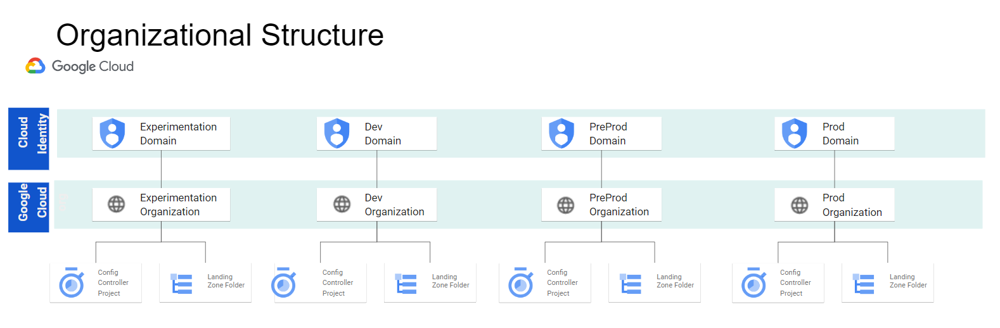

# Sample LZ v2

This directory contains examples of how to structure the LZ v2 packages to meet the following architectures.

## Single GCP organization

Contains an example implementation of the following design.

## Multi Org Setp

Contains an example implementation of the following design.

## Structure

Both the environments created in both the Single Org and Multi Org designs will the following structure.

## Which to choose

### Multi-Org

Choose multi-org if you are looking for a hire degree of separation between environments but incures hire over head as you need multiple GCP Organizations.

### Single Org

The single org pattern requires less overhead and environments are separated by Folders and IAM Roles.
