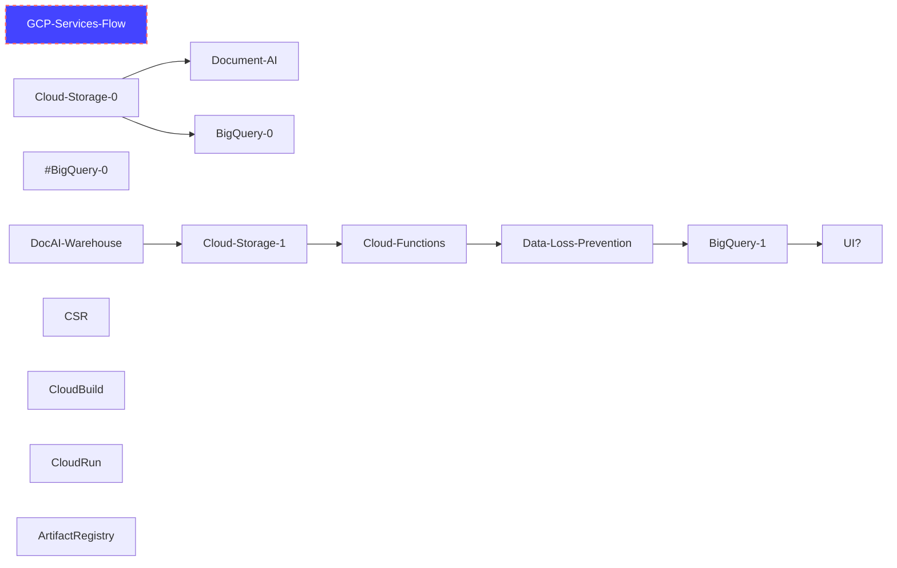

# Document Processing

## Description
This packge contains the minimal set of infrastructure needed to help with a document processing environment.

## Cloning the Repository
Run the following to open the shell and auto clone the repo into the cloudshell_open directory off your shell user directory. 

[](https://console.cloud.google.com/cloudshell/open?git_repo=https://github.com/GoogleCloudPlatform/pubsec-declarative-toolkit&page=editor&tutorial=README.md)

CD into the solutions folder

```
cd cloudshell_open/pubsec-declarative-toolkit/solutions/document-processing/gcloud
```

Switch to the canary branch

```
git checkout canary
```

## Architecture
- paraphrasing from original architecture diagram from internal AI CE team under S.A.




## Usage
- see https://github.com/GoogleCloudPlatform/pubsec-declarative-toolkit/issues/220
- clone the repo from https://github.com/GoogleCloudPlatform/pubsec-declarative-toolkit
- navigate/cd to the directory /solutions/document-processing

### KCC - via Kubernetes Config Controller

### Gcloud - via sh script

#### Creating a project

Run the following and substitute the following
- pdt-tgz (use your own previously created bootstrap project id)

```
cd gcloud
export BOOT_PROJECT_ID=pdt-tgz
export UNIQUE_PREFIX=user-mo
gcloud config set project $BOOT_PROJECT_ID
./deployment.sh -b $BOOT_PROJECT_ID -u UNIQUE_PREFIX -c true -l false -e user@domain.com -d false
```

#### Deleting a project
- where kcc-lz-883 is the last created project id
```
./deployment.sh -b pdt-tgz -u user-mo -c false -l false -d true -e user@domain.com -p kcc-lz-883
```
## Refereneces
- https://cloud.google.com/config-connector/docs/overview
- https://cloud.google.com/config-connector/docs/how-to/getting-started
- CFT - https://github.com/GoogleCloudPlatform/cloud-foundation-toolkit/tree/master/config-connector/solutions
