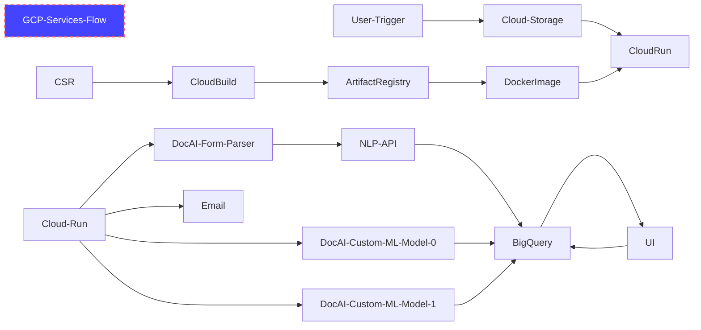
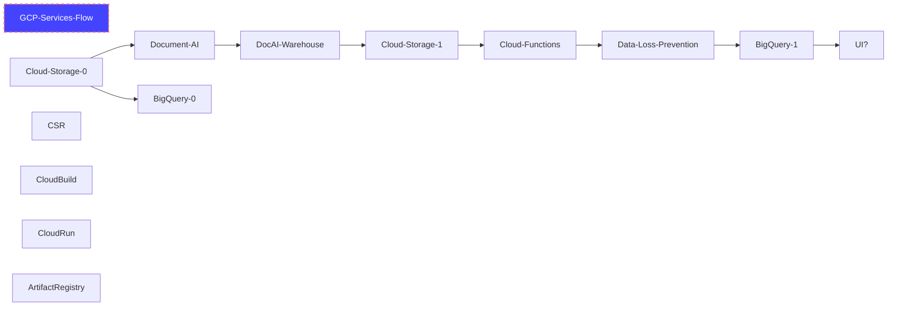

# Document Processing

## Description
This packge contains the minimal set of infrastructure needed to help with a document processing environment.

## Quickstart
### Cloning the Repository
- navigate/create a project directory in cloud shell
```
mkdir ~/docproc
export ROOT_DIR=~/docproc
```
- clone https://github.com/GoogleCloudPlatform/pubsec-declarative-toolkit
```
cd $ROOT_DIR
git clone https://github.com/GoogleCloudPlatform/pubsec-declarative-toolkit.git
```
- switch to the canary branch
```
cd pubsec-declarative-toolkit/solutions/document-processing
git checkout canary
```

### Preparation for CSR
- copy the internal repository zip into your cloud shell editor in the root project directory "ROOT_DIR" and unzip it

```
cd ~/$ROOT_DIR
unzip docproc.zip
```
- adjust environment variables in vars.sh to point to your repo dir - ie: $CSR_DIR=$ROOT_DIR/docproc
- The Cloud Source Repository will be created from this directory

## Architecture
- paraphrasing from original architecture diagram from internal AI CE team under S.A.
### Current Use Case



### Alternate Use Case - deprecated



## Usage
- see https://github.com/GoogleCloudPlatform/pubsec-declarative-toolkit/issues/220
- clone the repo from https://github.com/GoogleCloudPlatform/pubsec-declarative-toolkit or use the cloud shell button above
- navigate/cd to the directory /solutions/document-processing

### Prerequisites
- You must have GCP Organization Administrator or Owner role level privileges
- Your GCP account must have increased quotas for [billing/project](https://github.com/GoogleCloudPlatform/pbmm-on-gcp-onboarding/blob/main/docs/google-cloud-onboarding.md#quota-increase) association - if generating more than 5 projects in the organization
- Cloud Identity accounts that will receive the provisioned project must have been created by the Super Admin already

### KCC - via Kubernetes Config Controller
- Reference CRDs for GCP services: https://cloud.google.com/config-connector/docs/reference/resource-docs/iam/iamserviceaccount and https://cloud.google.com/config-connector/docs/how-to/getting-started
### Gcloud - via sh script

#### CD into the solutions folder
```
cd cloudshell_open/pubsec-declarative-toolkit/solutions/document-processing/gcloud
```

#### Switch to the canary branch
```
git checkout canary
```
#### Create a project

As an admin level user...

Run the following and substitute the following for each user being provisioned a project.
- ie: pdt-tgz (use your own previously created bootstrap project id instead)

```
export BOOT_PROJECT_ID=pdt-tgz
export UNIQUE_PREFIX=user-mo
gcloud config set project $BOOT_PROJECT_ID
./deployment.sh -b $BOOT_PROJECT_ID -u UNIQUE_PREFIX -c true -l false -e user@domain.com -d false
```
3 min


#### Restricted user navigates to the project


#### Deleting a project
- where kcc-lz-883 is the last created project id
```
./deployment.sh -b pdt-tgz -u pdt3 -c false -l false -d true -p kcc-lz-325
```


## Refereneces
- https://cloud.google.com/config-connector/docs/overview
- https://cloud.google.com/config-connector/docs/how-to/getting-started
- CFT - https://github.com/GoogleCloudPlatform/cloud-foundation-toolkit/tree/master/config-connector/solutions
