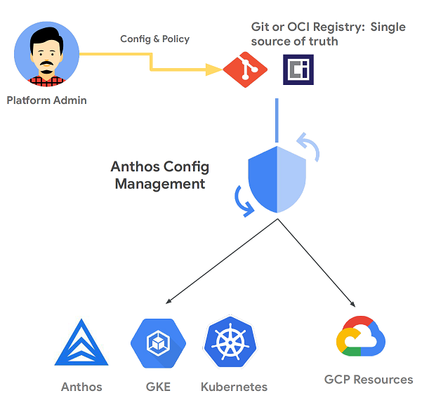
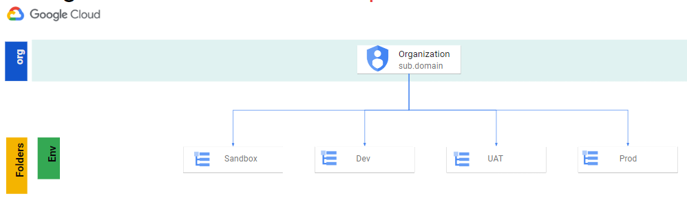
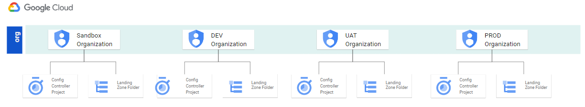
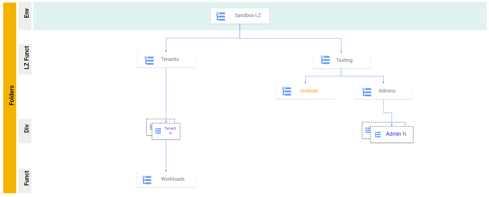
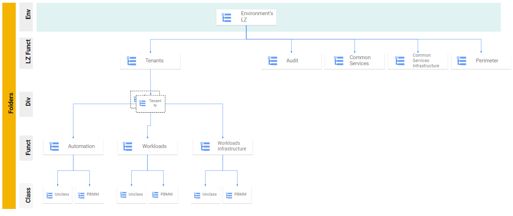

# KRM Landing Zone v2

This solution uses [Config Controller](https://cloud.google.com/anthos-config-management/docs/concepts/config-controller-overview) to deploy and manage the GCP infrastructure. 

Config Controller is a hosted service to provision and orchestrate Anthos, GKE, Kubernetes and Google Cloud resources. It offers an API endpoint that can provision, actuates, and orchestrates Google Cloud resources as part of Anthos Config Management.



This Landing Zone v2 differentiates from the `solutions/landing-zone` mostly because it provides flexibility by allowing you to select the sub-packages variants that best fit your requirements. It also uses multiples least privilege core GCP service account which are linked to distinct kubernetes namespaces using workload identity. 

# Implementation

You may want to look at the [documentation](https://github.com/ssc-spc-ccoe-cei/gcp-documentation) published by **Shared Services Canada**, providing a good level of details on how they have implemented this landing zone solution to host workloads from any of the 43 departments of the Government of Canada.

# Organization

This Landing Zone v2 assumes that the different required environments known as Sandbox, Development, User Acceptance and Testing, Production are all instantiated with their own landing zone. This can be achieved with a single GCP organization and multiple landing zone folders representing the environments OR by using multiple GCP organizations.

## Single GCP organization


## Multiple GCP organizations



# Folder Structure
## The sandbox landing zone contains the following folder structure.



## The Dev, UAT and Prod landing zones contain the following folder structure.



# Setup

To deploy this Landing Zone you will need to:
  1. Complete the bootstrap procedure.
  2. Create your landing zone.
  3. Deploy the infrastructure using either kpt or gitops-git or gitops-oci.

# 1. Complete the boostrap procedure 

## Requirements
1. Cloud identity has been deployed
1. GCP IAM persmissions for the account executing this procedure:
   - Org level:
      - Organization Admin
      - Folder Admin
      - Project Admin
      - Compute Network Admin
      - Service Directory Editor
      - DNS Administrator
    - Billing account:
      - Billing admin
1. Software
    * [Google Cloud SDK version >= 325.0.0](https://cloud.google.com/sdk/docs/downloads-versioned-archives)
    * [kpt](https://kpt.dev/installation/)
    * [kubectl](https://kubernetes.io/docs/tasks/tools/) ( >= v1.20)

## Summary
- Initial Organization configuration.
- A GCP folder to host the landing zone hierarchy.
- A config controller project.
- A VPC, a subnet and a Cloud NAT.
- Private Service Connect to access googleapis.com and gcr.io
- VPC firewall rules.
- A config controller cluster.
- IAM permission for the "Yakima" service account.
- The K8S secret to access the repository.
- The initial root-sync.yaml.
- Grant billing user role to projects-sa service account.


## Initial Organization configuration

1. Define environment variables
    ```
    CLUSTER=<cluster-name>
    REGION=northamerica-northeast1
    PROJECT_ID=<project-id>
    LZ_FOLDER_NAME=<env>-<landing zone name>
    NETWORK=<vpc-name>
    SUBNET=<subnet-name>
    ORG_ID=<your_org_id>
    ROOT_FOLDER_ID=<your_folder_id> # This one is only required if not deploying at the org level. See option 2 below. (ex. for testing)
    BILLING_ID=XXXXX-XXXXX-XXXXX
    GIT_USERNAME=<git username> # For Azure Devops, this is the name of the Organization
    TOKEN=XXXXXXXXXXXXXXXXXXXXXXXXXXXXXXXXXXXXXXX
    ```

1. Set Default Logging Storage Location.

    This command will ensure that the default logging buckets that are generated with a new project (organization wide) are set to the selected region instead of the default location `global`.  
    ```
    gcloud alpha logging settings update --organization=$ORG_ID --storage-location=$REGION
    ```
1. Create the Organization level Access Context Manager policy
    There can only be one organization level ACM policy per organization
    ```
    # Validate if an ACM policy exist
    gcloud access-context-manager policies list --organization=${ORG_ID}

    # To create an ACM policy that applies to the entire organization, run:

    gcloud access-context-manager policies create \
      --organization=organizations/${ORG_ID} --title="My Policy"
    ```

## Config Controller project and cluster

1. Create LZ folder
    ### Option 1 - Org level folder
    ```
    FOLDER_ID=$(gcloud resource-manager folders create --display-name=$LZ_FOLDER_NAME --organization=$ORG_ID --format="value(name)" --quiet | cut -d "/" -f 2)
    ```
    ### Option 2 - Folder in a Folder
    ```
    FOLDER_ID=$(gcloud resource-manager folders create --display-name=$LZ_FOLDER_NAME  --folder=$ROOT_FOLDER_ID --format="value(name)" --quiet | cut -d "/" -f 2)
    ```
1. Create config controller project
    ### Option 1 - Org level Project
    ```
    gcloud projects create $PROJECT_ID --set-as-default --organization=$ORG_ID
    ```
    ### Option 2 - Project in a Folder
    ```
    gcloud projects create $PROJECT_ID --set-as-default --folder=$ROOT_FOLDER_ID
    ```
1. Enable Billing
    ```
    gcloud beta billing projects link $PROJECT_ID --billing-account $BILLING_ID 
    ```
1. Set the project ID
    ```
    gcloud config set project $PROJECT_ID
    ```
1. Enable the required services
    ```
    gcloud services enable krmapihosting.googleapis.com container.googleapis.com cloudresourcemanager.googleapis.com cloudbilling.googleapis.com serviceusage.googleapis.com servicedirectory.googleapis.com dns.googleapis.com
    ```

1. Create network
    ```
    gcloud compute networks create $NETWORK --subnet-mode=custom

    gcloud compute networks subnets create $SUBNET  \
    --network $NETWORK \
    --range 192.168.0.0/16 \
    --region $REGION \
    --stack-type=IPV4_ONLY \
    --enable-private-ip-google-access \
    --enable-flow-logs --logging-aggregation-interval=interval-5-sec --logging-flow-sampling=1.0 --logging-metadata=include-all

    # Cloud router and Cloud NAT
    gcloud compute routers create kcc-router --project=$PROJECT_ID  --network=$NETWORK  --asn=64513 --region=$REGION
    gcloud compute routers nats create kcc-router --router=kcc-router --region=$REGION --auto-allocate-nat-external-ips --nat-all-subnet-ip-ranges --enable-logging
    ```

1.  Private Service Connect to access Google's API
    ```
    # enable logging for dns 
    gcloud dns policies create dnspolicy1 \
    --networks=$NETWORK \
    --enable-logging \
    --description="dns policy to enable logging"

    # private ip for apis
    gcloud compute addresses create apis-private-ip \
    --global \
    --purpose=PRIVATE_SERVICE_CONNECT \
    --addresses=10.255.255.254 \
    --network=$NETWORK

    # private endpoint
    gcloud compute forwarding-rules create endpoint1 \
    --global \
    --network=$NETWORK \
    --address=apis-private-ip \
    --target-google-apis-bundle=all-apis \
    --service-directory-registration=projects/$PROJECT_ID/locations/$REGION

    # private dns zone for googleapis.com
    gcloud dns managed-zones create googleapis \
    --description="dns zone for googleapis" \
    --dns-name=googleapis.com \
    --networks=$NETWORK \
    --visibility=private

    gcloud dns record-sets create googleapis.com. --zone="googleapis" --type="A" --ttl="300" --rrdatas="10.255.255.254"

    gcloud dns record-sets create *.googleapis.com. --zone="googleapis" --type="CNAME" --ttl="300" --rrdatas="googleapis.com."

    # private dns zone for gcr.io
    gcloud dns managed-zones create gcrio \
    --description="dns zone for gcrio" \
    --dns-name=gcr.io \
    --networks=$NETWORK \
    --visibility=private

    gcloud dns record-sets create gcr.io. --zone="gcrio" --type="A" --ttl="300" --rrdatas="10.255.255.254"

    gcloud dns record-sets create *.gcr.io. --zone="gcrio" --type="CNAME" --ttl="300" --rrdatas="gcr.io."
    ```

1. Create firewall rules
    ```
    # Allow egress to AZDO (optionnal) - should be revised periodically
    gcloud compute firewall-rules create allow-egress-azure --action ALLOW --rules tcp:22,tcp:443 --destination-ranges 13.107.6.0/24,13.107.9.0/24,13.107.42.0/24,13.107.43.0/24 --direction EGRESS --priority 5000 --network $NETWORK --enable-logging

    # Allow egress to Github (optionnal) - should be revised periodically - https://api.github.com/meta
    gcloud compute firewall-rules create allow-egress-github --action ALLOW --rules tcp:22,tcp:443 --destination-ranges 192.30.252.0/22,185.199.108.0/22,140.82.112.0/20,143.55.64.0/20,20.201.28.151/32,20.205.243.166/32,102.133.202.242/32,20.248.137.48/32,20.207.73.82/32,20.27.177.113/32,20.200.245.247/32,20.233.54.53/32,20.201.28.152/32,20.205.243.160/32,102.133.202.246/32,20.248.137.50/32,20.207.73.83/32,20.27.177.118/32,20.200.245.248/32,20.233.54.52/32 --direction EGRESS --priority 5001 --network $NETWORK --enable-logging

    # Allow egress to internal, peered vpc and secondary ranges
    gcloud compute firewall-rules create allow-egress-internal --action ALLOW --rules=all --destination-ranges 192.168.0.0/16,172.16.0.128/28,10.0.0.0/8 --direction EGRESS --priority 1000 --network $NETWORK --enable-logging
     
    # Deny egress to internet
    gcloud compute firewall-rules create deny-egress-internet --action DENY --rules=all --destination-ranges 0.0.0.0/0 --direction EGRESS --priority 65535 --network $NETWORK --enable-logging
    ```

1. Create anthos config controller cluster
    ### GKE Autopilot - Fully managed cluster
    TODO: TBD

    ### GKE Standard
    ```
    gcloud anthos config controller create $CLUSTER --location $REGION --network $NETWORK --subnet $SUBNET 
    ```
1. Get Credentials
    ```
    gcloud anthos config controller get-credentials $CLUSTER  --location $REGION
    kubens config-control
    ```
1. Set permissions for "Yakima" (Google managed) service account
    ```
    gcloud anthos config controller get-credentials $CLUSTER --location $REGION 

    export SA_EMAIL="$(kubectl get ConfigConnectorContext -n config-control \
        -o jsonpath='{.items[0].spec.googleServiceAccount}' 2> /dev/null)"

    gcloud organizations add-iam-policy-binding "${ORG_ID}" \
      --member="serviceAccount:${SA_EMAIL}" \
      --role=roles/resourcemanager.organizationAdmin \
      --condition=None
      
    gcloud projects add-iam-policy-binding "${PROJECT_ID}" \
      --member "serviceAccount:${SA_EMAIL}" \
      --role "roles/editor" \
      --project "${PROJECT_ID}"

    gcloud projects add-iam-policy-binding "${PROJECT_ID}" \
      --member "serviceAccount:${SA_EMAIL}" \
      --role "roles/iam.serviceAccountAdmin" \
      --project "${PROJECT_ID}"
    ```
  1. Well done !!! You have completed the Bootstrap procedure


# 2. Create your landing zone 

## Fetch the packages

You will be running the following commands from a linux machine. GCP Cloud Shell can be used to serve that purpose.


We will be using kpt to obtain the packages. For more information on the `kpt get` command, please refer to this link : https://kpt.dev/reference/cli/pkg/get/

1. Get the landing zone package
    ```
    kpt pkg get https://github.com/GoogleCloudPlatform/pubsec-declarative-toolkit.git/solutions/landing-zone-v2/landing-zone@main ./landing-zone
    ```
1. Get the hierarchy package
    - Sandbox
      ```
      kpt pkg get https://github.com/GoogleCloudPlatform/pubsec-declarative-toolkit.git/solutions/hierarchy/core-sandbox@main ./landing-zone/hierarchy
      ```

    - DEV, UAT, PROD
      ```
      kpt pkg get https://github.com/GoogleCloudPlatform/pubsec-declarative-toolkit.git/solutions/hierarchy/core-env@main ./landing-zone/hierarchy
      ```
1. Get the gatekeeper policies package
    ```
    kpt pkg get https://github.com/GoogleCloudPlatform/pubsec-declarative-toolkit.git/solutions/gatekeeper-policies@main ./landing-zone/gatekeeper-policies
    ```
1. Get the organization policies package
    ```
    kpt pkg get https://github.com/GoogleCloudPlatform/pubsec-declarative-toolkit.git/solutions/org-policies@main ./landing-zone/org-policies
    ```
1. Get the logging package
    TODO: TBD
1. etc.
    
## Customize Packages

 Review and customize all packages `setters.yaml` with the configuration of your landing zone. 


## Deployment

 This solution can be deployed in a few different ways depending on the behavior you want. 
  - kpt
  - GitOps
    - [Git](#git)
    - [OCI](#oci)


 Deploying through `kpt` is a more traditional push approach to deploying the infrastructure. This will deploy the infrastructure resources into the target cluster similar to how `kubectl` operates. Some of the deployment advantages `kpt` offers is the ability to use functions live `render` to populate variables in the configuration and `gatekeeper` which allows us to validate policy before deployment. 

 When deploying resources `kpt` will wait for all resources to deploy before finishing, `kpt` also provides annotations such as [depends-on](https://kpt.dev/reference/annotations/depends-on/) that allow us to order the deployment of resources. 

 GitOps allows us to connect our cluster to a "source of truth" and deploy from that. To do this we use [Anthos Config Management](https://cloud.google.com/anthos/config-management), which is pre-installed in Config Controller, and this allows us to target either a [Git Repository](https://cloud.google.com/anthos-config-management/docs/concepts/configs) or [OCI Artifact](https://cloud.google.com/anthos-config-management/docs/how-to/publish-config-registry) (Container). 
    
 The benefit to this method is we now have an additional reconciliation process to ensure the deployed state matches our desired state or "source of truth". This also allows for improved automation and removes the need to run `kpt live apply` to deploy resources.

 ## kpt
    
 Before deploying with `kpt` you will need to add `constraints.yaml` to the `.krmignore` file. This is due to needing to have the `constraintstemplate` resources deployed into the instance before the policy `constraint` can be deployed. Once the `constrainttemplates` have been deployed you can remove `constraints.yaml` from the `.krmignore` file and redeploy. This is not needed with either gitops deployment options.

 Before running the `kpt` commands for the first time you will need to initialize the `kpt` package locally. You will only need to do this once after you initially get the `kpt` package

 The following commands assume the `landing-zone-v2` package is in your currently directory. If you are in the `landing-zone-v2` directory you can remove omit the `landing-zone-v2` argument from the commands.

  ```
    kpt live init landing-zone-v2 --namespace config-control
  ```

  ```
    kpt fn render landing-zone-v2
    kpt live apply landing-zone-v2 --reconcile-timeout=2m --output=table
  ```

 The section around billing that looks like the following and can either be commented out or deleted.
  ```
    billingAccountRef:
        # Replace "${BILLING_ACCOUNT_ID?}" with the numeric ID for your billing account
        external: "${BILLING_ACCOUNT_ID?}" # kpt-set: ${billing-id}
  ```

 This will cause the project to spin up with no attached billing id and any service that requires billing to be enabled will pause deployment until billing is enabled. Billing can be added by a user with Billing User permission in the Billing UI. If you do not remove this section the project will fail to create.

 You can view the status of any deployed object by running `kubectl get gcp` when connected to the Config Controller instance. If an object is pending or is displaying an error you can investigate by copying the name of the object and running the describe command.

 TODO: adjust the line below once the logging solution is in place.
 For example `kubectl describe storagebucket.storage.cnrm.cloud.google.com/audit-sink-audit-prj-12345`.

 ## GitOps - Git

   Deploy Infrastructure via GitOps using Anthos Config Management

   To start you will need a git repo, this guide can be used with repositories residing in Github, Gitlab or Azure Devops. The instructions have been modified from the config controller setup guide located in [Manage Google Cloud resources with Config Controller](https://cloud.google.com/anthos-config-management/docs/how-to/config-controller-setup#manage-resources) and [Setup GitOps](https://cloud.google.com/anthos-config-management/docs/how-to/config-controller-setup#set_up_gitops). 
   
   ***Skip this step if not using git repos.**


### Create a new repository in your Repo Hosting Solution (Github, Gitlab or Azure Devops)

  1. This step is out-of-scope of this procedure


### ConfigSync
Now that we have a git repo set up we can configure the Config Controller's ConfigSync operator to observe it in order to deploy our infrastructure.

1. Create `git-creds` secret with the required value to access the git repository
    ```
    kubectl create secret generic git-creds --namespace="config-management-system" --from-literal=username=${GIT_USERNAME} --from-literal=token=${TOKEN}
    ```

1. Configure the `RootSync` object

    Create a file using the example below
    ```
    cat <<EOF>> root-sync.yaml
    apiVersion: configsync.gke.io/v1beta1
    kind: RootSync
    metadata:
      name: root-sync
      namespace: config-management-system
    spec:
      sourceFormat: unstructured
      git:
        repo: <REPO_URL>
        branch: <REPO_BRANCH> # ex. : main
        dir: <REPO_PATH> # ex.: deploy
        revision: <REPO_VERSION> # ex. : 0.0.0
        auth: token
        secretRef:
          name: git-creds
    EOF
    ```

1. Deploy the Config Sync Manifest
    ```
    kubectl apply -f root-sync.yaml
    kubectl wait --for condition=established --timeout=10s crd/rootsyncs.configsync.gke.io
    ```

1. Clone the empty repo created earlier
    ```
    git clone <REPO_URL>
    cd <REPO_FOLDER>
    ```
1. Copy your landing zone folder to this new repo

1. Hydrate files
    ```
    kpt fn render
    ```

1. Push landing zone to Git
    ```
    # Checkout the main branch
    git checkout -b main
    # Review changes 
    git diff
    # Prepare your commit by staging the files
    git add . 
    # Commit your changes
    git commit -m "<MEANINGFULL MESSAGE GOES HERE>"
    # Push your changes to origin
    git push --set-upstream origin main
    ```
1. Congratulations !!! you have completed the GitOps - Git configuration

 ## GitOps - OCI

Before we deploy via OCI we have a few things we'll need to do to prepare our environment.

### Artifact Registry
First we'll need to create an artifact registry to store our OCI artifacts.

1. Let's set some environment variables to start
    ```
    export PROJECT_ID=<PROJECT_ID>
    export AR_REPO_NAME=<REPO_NAME>
    export GSA_NAME="config-management-oci"
    ```

1. Enable Artifact Registry
    ```
    gcloud services enable artifactregistry.googleapis.com \
    --project=${PROJECT_ID}
    ```

1. Create a new repository
    ```
    gcloud artifacts repositories create ${AR_REPO_NAME} \
    --repository-format=docker \
    --location=northamerica-northeast1 \
    --description="Config Sync OCI repo" \
    --project=${PROJECT_ID}
    ```

1. Create a Service Account for Config Management to Access the Artifact Repository.
    ```
    gcloud iam service-accounts create $GSA_NAME --project=${PROJECT_ID}
    ```

1. Assign it the read permissions
    ```
    gcloud artifacts repositories add-iam-policy-binding ${AR_REPO_NAME} \
    --member "serviceAccount:${GSA_NAME}@${PROJECT_ID}.iam.gserviceaccount.com" \
    --location northamerica-northeast1 \
    --role "roles/artifactregistry.reader"
    ```

1. Allow the SA to be accessed by the Root Sync Service account.
    ```
    gcloud iam service-accounts add-iam-policy-binding ${GSA_NAME}@${PROJECT_ID}.iam.gserviceaccount.com \
    --role roles/iam.workloadIdentityUser \
    --member "serviceAccount:${PROJECT_ID}.svc.id.goog[config-management-system/root-reconciler]"
    ```

### Push Config Image to the repository

1. Install crane and login to Artifact Registry
    ```
    go install github.com/google/go-containerregistry/cmd/crane@latest
    crane auth login northamerica-northeast1-docker.pkg.dev  -u oauth2accesstoken -p "$(gcloud auth print-access-token)"
    ```

1. Render the Configs

    ```
    kpt fn render landing-zone-v2
    ``` 

1. Once that has completed we can build our OCI Artifact with the crane CLI.
    ```
    crane append -f <(tar -f - -c .) -t northamerica-northeast1-docker.pkg.dev/$PROJECT_ID/${AR_REPO_NAME}/landing-zone:v1
    ```

1. Now that our Landing Zone Artifact has been built we can create a `RootSync` object which will tell the Config Management service where to find the Configs for deployment.

    ```
    cat <<EOF>> lz-oci.yaml
    apiVersion: configsync.gke.io/v1beta1
    kind: RootSync
    metadata:
      name: root-sync
      namespace: config-management-system
    spec:
      sourceFormat: unstructured
      sourceType: oci
      oci:
        image: northamerica-northeast1-docker.pkg.dev/$PROJECT_ID/${AR_REPO_NAME}/landing-zone:v1
        dir: environments
        auth: gcpserviceaccount
        gcpServiceAccountEmail: ${GSA_NAME}@${PROJECT_ID}.iam.gserviceaccount.com
    EOF
    ```

1. Apply it to the target cluster.
    ```
    kubectl apply -f lz-oci.yaml
    ```
1. Congratulations !!! you have completed the GitOps - OCI configuration

# Validating landing zone deployment

```
nomos status --contexts gke_${PROJECT_ID}_northamerica-northeast1_krmapihost-${CLUSTER}
```

# Post deployment
## Grant billing account user role

1. **WAIT** until the GCP Service Account `projects-sa` has been created. 
    - K8S resource name is `iamserviceaccount.iam.cnrm.cloud.google.com/projects-sa`

1. Grant billing account user role to projects-sa (repeat this step on all billing account used in the landing zone)
    ```
    gcloud beta billing accounts add-iam-policy-binding "${BILLING_ID}" \
      --member "serviceAccount:projects-sa@${PROJECT_ID}.iam.gserviceaccount.com" \
      --role "roles/billing.user"
    ```
# Clean Up

Follow the below steps to delete the provisioned infrastructure and Config Controller instances.

If you want the deployed resources to live on and just destroy the Config Controller instance you can do so by running `gcloud anthos config controller instance-name --location instance-region`. This will remove the config controller instances but leave the resources it deployed untouched.

To reacquire the resources you will need to redeploy a new instance and deploy the same configs to it. Config Controller should reattach to the previously deployed instances and start managing them again.

## kpt

First run either
```
kpt live destroy
```

or

```
kubectl delete gcp --all
```

Finally delete the Config Controller instance

```
gcloud anthos config controller instance-name --location instance-region
```

## OCI
First delete the Rootsync deployment. This will prevent the resources from self-healing.

```
kubectl delete rootsync landing-zone -n config-management-system
```

Now we can delete our KCC resources from the Config Controller instance.

```
kubectl delete gcp --all -n config-control
```

Once the resources have been deleted you can delete the config controller instance .
  
If you have forgotten the name of the instance you can run `gcloud config controller list` to reveal the instances in your project.

```
gcloud anthos config controller delete instance-name --location instance-region
```
