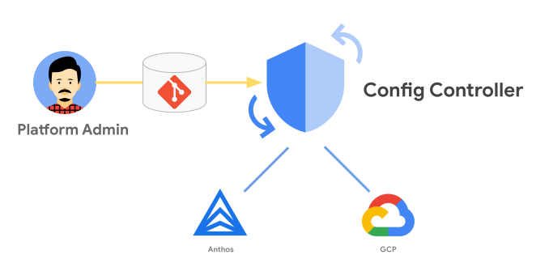

# KRM Landing Zone

This is a reimplementation of [pbmm-on-gcp-onboarding](https://github.com/GoogleCloudPlatform/pbmm-on-gcp-onboarding) Landing Zone using KRM.

The goal of this repo is to have parity with pbmm-on-gcp-onboarding repository using [Config Controller](https://cloud.google.com/anthos-config-management/docs/concepts/config-controller-overview) to deploy and manage the infrastructure.

Config Controller is a hosted service to provision and orchestrate Anthos and Google Cloud resources. It offers an API endpoint that can provision, actuate, and orchestrate Google Cloud resources as part of Anthos Config Management.



## Organzation

This Landing Zone will create an initial 3 environments.

Creates 3 Environments
- Common
- Non-prod
- Prod

These configurations for these environments is contained in the environments directory (`environments/`) of this package.

The following folder structure and projects will be deployed. 

*Assume folder unless identified as a project*

```
Infrastructure:
  - Networking:
      - ProdNetworking
        - Production Network Project
      - NonProdNetworking
        - Non Production Network Project
  - SharedInfrastructure
Sandbox
Workloads:
  - Prod
  - UAT
  - DEV
Audit and Security:
  - Audit
    - Guardrails Project
    - Audit Bunker Project
  - Security
    - Common Network Perimeter Project
Automation
Shared Services
```

The following resources will be deployed.

### Common
| Resource | Name | Purpose | Status | Location |
| ---- | ---- | ---- | --- | -- |
| Access Context Manager | | | Work In Progress | `environments/common/vpc-service-controls`
| Core Audit Bunker | | | Available | `environments/common/audit` |
| Core Folders | | | Available | `environments/common/hiearchy.yaml` |
| Core IAM | | | Available | `environments/common/iam` |
| Core Org Custom Roles | | File for Custom Org Roles | Available | `environments/common/iam` |
| Core Org Policy | | Default Org Policies | Available | `environments/common/policies` |
| Guardrails | | | Available | `environments/common/guardrails-policies` |
| Base Network Perimeter | | | Available | `environments/common/network` |
| Network Management Perimeter | | | Available | `environments/common/network` |

### Non-Prod
| Resource | Name | Purpose | Status | Location |
| ---- | ---- | ---- | --- | -- |
| VPC Service Control | | | Available | `environments/nonprod/shared-vpc` |
| VPN Controllers | |  | Not Available | `environments/nonprod/network` |
| Network Host Project | | | Available | `environments/nonprod/network` |
| Firewall | | | Available | `environments/nonprod/firewall` |

### Prod
| Resource | Name | Purpose | Status | Location |
| ---- | ---- | ---- | --- | -- |
| Network Host Project | | | Available | `environments/nonprod/network` |
| VPC Service Controls | | | Available | `environments/nonprod/vpc-service-controls` |
| Network Perimeter Project | | | Available | `environments/nonprod/network` |
| Network HA Perimeter | | | Available | `environments/nonprod/network` |
| Net Private Perimeter | | | Available | `environments/nonprod/network` |
| Firewall | | | Available | `environments/nonprod/firewall` |
| Network Private Perimeter Firewall | | | Available | `environments/nonprod/firewall` |
| Network Public Perimeter Firewall | | | Available | `environments/nonprod/firewall` |


## Usage

To deploy this Landing Zone you will first need to create a Bootstrap project with a Config Controller instance.

1. Deploy Bootstrap

    ```
    arete create landing-zone-controller
    ```

    This command will create a new project and deploy a Config Controller instance for you. This will create a project at the top level and can be moved into a folder if you like.

    Set Permissions additional permission
    ```
    export ORG_ID=your-org-id
    export SA_EMAIL="$(kubectl get ConfigConnectorContext -n config-control -o jsonpath='{.items[0].spec.googleServiceAccount}' 2> /dev/null)"
    gcloud organizations add-iam-policy-binding "${ORG_ID}" --member "serviceAccount:${SA_EMAIL}" --role "roles/resourcemanager.folderAdmin"
    gcloud organizations add-iam-policy-binding "${ORG_ID}" --member "serviceAccount:${SA_EMAIL}" --role "roles/resourcemanager.projectCreator"
    gcloud organizations add-iam-policy-binding "${ORG_ID}" --member "serviceAccount:${SA_EMAIL}" --role "roles/resourcemanager.projectDeleter"
    gcloud organizations add-iam-policy-binding "${ORG_ID}" --member "serviceAccount:${SA_EMAIL}" --role "roles/iam.securityAdmin"
    gcloud organizations add-iam-policy-binding "${ORG_ID}" --member "serviceAccount:${SA_EMAIL}" --role "roles/orgpolicy.policyAdmin"
    gcloud organizations add-iam-policy-binding "${ORG_ID}" --member "serviceAccount:${SA_EMAIL}" --role "roles/serviceusage.serviceUsageConsumer"
    gcloud organizations add-iam-policy-binding "${ORG_ID}" --member "serviceAccount:${SA_EMAIL}" --role "roles/billing.user" 
    gcloud organizations add-iam-policy-binding "${ORG_ID}" --member "serviceAccount:${SA_EMAIL}" --role roles/accesscontextmanager.policyAdmin
    gcloud organizations add-iam-policy-binding "${ORG_ID}" --member "serviceAccount:${SA_EMAIL}" --role roles/compute.xpnAdmin
    gcloud organizations add-iam-policy-binding "${ORG_ID}" --member "serviceAccount:${SA_EMAIL}" --role roles/iam.serviceAccountAdmin
    gcloud organizations add-iam-policy-binding "${ORG_ID}" --member "serviceAccount:${SA_EMAIL}" --role roles/serviceusage.serviceUsageConsumer
    gcloud organizations add-iam-policy-binding "${ORG_ID}" --member "serviceAccount:${SA_EMAIL}" --role roles/logging.admin
    ```
    
2. Fetch the package

    `kpt pkg get git@github.com:GoogleCloudPlatform/pubsec-declarative-toolkit.git/solutions/landing-zone landing-zone`

    Details: https://kpt.dev/reference/cli/pkg/get/

3. Set Organization Hierarchy

    Modifiy `environments/common/hiearchy.yaml` if required. 

4. Customize Package

    Edit `setters.yaml` with the relevant information. 

    Emails used for groups should be exist in iam/groups before running the script.

    Project Number and Project ID for the management project will be for the project that the config controller instance runs in.  

    | Name | Default | Description |
    | --- | --- | --- |
    | billing-id | "0000000000" | Billing ID used with created projects |
    | org-id | "0000000000" | Target Organization ID |
    | management-project-id | management-project-12345  | ID of the Project where the Config Controller instance is located |
    | management-project-number | "0000000000" |  Number of the Project where the Config Controller instance is location |
    | net-host-prj-nonprod-id | net-host-prj-nonprod-12345 | ID to be used for the Non-Prod Network Host Project |
    | net-host-prj-prod-id | net-host-prj-prod-12345 | ID to be used for the Prod Network Host Project |
    | net-perimeter-prj-common-id | net-perimeter-prj-common-12345 | ID to be used for the Common Network Perimeter Host Project |
    | audit-prj-id | audit-prj-id-12345 | ID to be used for the Audit Project |
    | guardrails-project-id | guardrails-project-12345 | ID to be used for the Guardrails Project |
    | audit-viewer | group@domain.com | Group email to get audit viewer permissions |
    | log-writer | group@domain.com | Group email to get log writer permissions |
    | log-reader | group@domain.com | Group email to get log reader permissions |
    | organization-viewer| group@domain.com | Group email to get org viewer permissions |

    **Note on Project IDs**: All IDs should be universally unique, Must be 6 to 30 characters in length, can only contain lowercase letters, numbers, and hyphens. Must start with a letter. Cannot end with a hyphen. Cannot be in use or previously used; this includes deleted projects. Cannot contain restricted strings, such as google and ssl.

5. Deploy

    a. kpt
    
    ```
    kpt fn render
    kpt live init landing-zone --namespace config-control
    kpt live apply landing-zone --reconcile-timeout=2m --output=table
    ```

    **Note**: Deploying without billing use permissions is possible but will require a user to manually add the billing account to the project. To do this you will need to remove the Billing Section of any deployed project (projects can be found in the following directories `common/projects`,`nonprod/projects`, `prod/projects`).

    The section looks like the following and can either be commented out or deleted.
    ```
    billingAccountRef:
        # Replace "${BILLING_ACCOUNT_ID?}" with the numeric ID for your billing account
        external: "${BILLING_ACCOUNT_ID?}" # kpt-set: ${billing-id}
    ```

    This will cause the project to spin up with no attached billing id and any service that requires billing to be enabled will pause deployment until billing is enabled. Billing can be added by a user with Billing User permission in the Billing UI. If you do not remove this section the project will fail to create.

    You can view the status of any deployed object by running `kubectl get gcp` when connected to the Config Controller instance. If an object is pending or is displaying an error you can investigate by copying the name of the object and running the describe command.

    For example `kubectl describe storagebucket.storage.cnrm.cloud.google.com/audit-sink-audit-prj-12345`.

    b. GitOps

      Deploy Infrastructure via GitOps using Anthos Config Management

    c. Cloud Deploy (future)