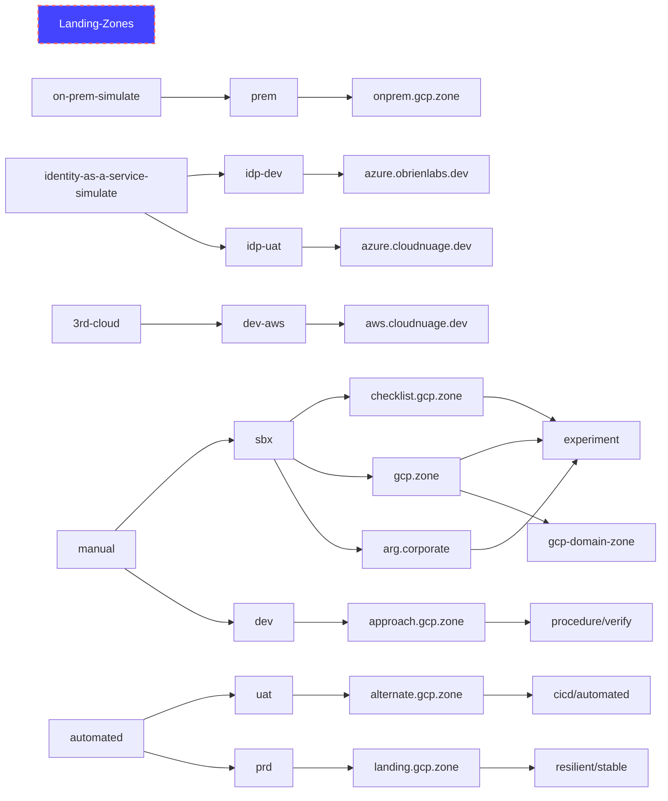

# PBMM Landing Zone Architecture and ConOps


## Purpose
Create, manage and operate a PBMM secure landing zone for the Google Cloud Environment. 

### Why Landing Zones
Expand on https://cloud.google.com/architecture/landing-zones/decide-network-design#option-2 in https://cloud.google.com/architecture/landing-zones#what-is-a-google-cloud-landing-zone

## Deliverables
### SC2G Deliverables
#### CDD: Conceptual Design Document
High leve applications and interconnections through the SC2G infrastructure.  Include examples of PaaS, SaaS, IaaS and hybrid applications.

#### SID: Solution Integration Document
This document details the connections, devices, network segments, zones, hostnames, ports, IPS of a particular application - usually worked out with the team implementing a particular workload.  The diagram centers on the GC-TIP and GC-CAP connections.

#### WIF: Workload Intake Form
A spreadsheet of cloud ingress/egress application flows with an implementation diagram.


## Installation/Deployment

### Deployment Preparations
#### Cloud Identity Onboarding and Organization Domain Validation
#### Billing Quota
#### Project Quota
#### Config Controller enabled Anthos GKE Cluster
- follow https://github.com/GoogleCloudPlatform/pubsec-declarative-toolkit/blob/main/solutions/landing-zone/README.md#usage


### Creating the Anthos Cluster
Use the advanced install at https://github.com/GoogleCloudPlatform/pubsec-declarative-toolkit/blob/main/docs/advanced-install.md

Verify that the shieldedVM org policy is off for the folder or project before starting the anthos cluster

```
michael@cloudshell:~ (landing-zone-controller-e4g7d)$ gcloud anthos config controller create landing-zone-controller --location northamerica-northeast1 --network kcc-controller --subnet kcc-regional-subnet
Create request issued for: [landing-zone-controller]
Waiting for operation [projects/landing-zone-controller-e4g7d/locations/northamerica-northeast1/operations/operation-1663186893923-5e8a8e001e619-34ef85f4-6e91f4fd] to complete...working.
```
### Updating the Anthos Cluster
### Deleting the Anthos Cluster
see https://github.com/GoogleCloudPlatform/pubsec-declarative-toolkit/issues/91

For the name, leave out the "krmapihost-" prefix
```
michael@cloudshell:~ (landing-zone-controller-1z583)$ gcloud anthos config controller delete landing-zone-controller --location=northamerica-northeast1
You are about to delete instance [landing-zone-controller]
Do you want to continue (Y/n)?  y
Delete request issued for: [landing-zone-controller]
Waiting for operation [projects/landing-zone-controller-1z583/locations/northamerica-northeast1/operations/operation-1663186645640-5e8a8d13563dd-418ffc6f-eb3f878d] to complete...working.
```
remember to delete the org policies added by the landing-zone to avoid https://github.com/GoogleCloudPlatform/pubsec-declarative-toolkit/issues/132
### Recreating the Anthos Cluster
gcp.zone
```
michael@cloudshell:~ (landing-zone-controller-e4g7d)$ gcloud anthos config controller create landing-zone-controller --location northamerica-northeast1 --network kcc-controller --subnet kcc-regional-subnet
Create request issued for: [landing-zone-controller]
Waiting for operation [projects/landing-zone-controller-e4g7d/locations/northamerica-northeast1/operations/operation-1663188232198-5e8a92fc658f2-a614c3a2-993952f2] to complete...working..

3) Not all instances running in IGM after 26.129857499s. Expected 1, running 0, transitioning 1. Current errors: [CONDITION_NOT_MET]: Instance 'gke-krmapihost-landing-z-default-pool-eafd49e4-6msn' creation failed: Constraint constraints/compute.requireShieldedVm violated for project projects/landing-zone-controller-e4g7d. Secure Boot is not enabled in the 'shielded_instance_config' field. See https://cloud.google.com/resource-manager/docs/organization-policy/org-policy-constraints for more information.

```
Issue is that the shieldedVM org policy will not allow the Anthos GKE cluster to come back up - delete it first to avoid issues with Anthos in a now landing-zone controlled organization (which is normal behaviour from an lz view) - https://github.com/GoogleCloudPlatform/pubsec-declarative-toolkit/issues/132
last deployment was still OK


### Deploying the Landing Zone
### Updating the Landing Zone from Upstream source
#### Reconciling
### Updating the Landing Zone Deployment with local changes
### Deleting the Landing Zone Deployment


## Architecture

### Diagrams
#### High Level Network Diagram
#### Low Level Zoning Diagram
### Naming Standard


### Backups
Trusted image policies can be setup using organization policies in IAM - see https://cloud.google.com/compute/docs/images/restricting-image-access
GCP services configurations and snapshots can be configured for scheduled automated snapshots to Google Cloud Storage using four tiers of short to long term storage.

Notes:
define a naming standard and schedule for automated snapshots 

### Configuration Management
All services, roles and artifacts inside the GCP organization are tracked in IAM Asset Inventory and Security Command Center - both change tracking.

### Logging
[Logging](https://console.cloud.google.com/logs) (part of the [Cloud Operations Suite](https://cloud.google.com/products/operations)) has its own dashboard.
The logging agent (ops - based on FluentD / OpenTelemetry) is on each VM - out of the box it captures OS logs (and optionally - application logs - which is configurable in the agent).  Log sources include service, vm, vpc flow and firewall logs.

#### Log Sinks
Google Cloud Logs can be routed using log sinks (with optional aggregation) to destinations like Cloud Storage (object storage), PubSub (message queue) or BigQuery (serverless data warehouse) with 4 levels of tiering for long term storage or auditing.

#### Audit Logging Policy
GCP provides for audit logging of admin, data access, system event and policy denied logs for the following [services](https://cloud.google.com/logging/docs/audit/services) - in addition to [access transparency logs](https://cloud.google.com/logging/docs/view/available-logs). Redacted user info is included in the audit log entries.  

### Network Zoning
Ref: ITSG-22: https://cyber.gc.ca/sites/default/files/cyber/publications/itsp80022-e.pdf - see ZIP (Zone Interface Points)
Ref: https://cloud.google.com/architecture/landing-zones

  The GCP PBMM Landing Zone architecture provides an automated and pluggable framework to help secure enterprise workloads using a governance model for services and cost distribution.

  The network zoning architecture is implemented via virtual SDN (software defined networking) in GCP via the [Andromeda framework](https://cloud.google.com/blog/products/networking/google-cloud-networking-in-depth-how-andromeda-2-2-enables-high-throughput-vms).  Physical and virtual zoning between the different network zones is the responsibility of GCP.  The physical networking and hosting infrastructure within and between the two canadian regions is the responsibility of GCP as per [PE-3](https://github.com/GoogleCloudPlatform/pbmm-on-gcp-onboarding/blob/main/docs/google-cloud-security-controls.md#3830pe-3physical-access-control)

  This PBMM architecture supports all the common network level security controls that would be expected within a zoned network around routing, firewall rules and access control.  The GCP PBMM Landing Zone will support the ITSG-22 Baseline Security Requirements for Network Security Controls.  Information flow is controlled between each network segment/zone via VPC networks, VPC Service Controls, Shared VPCs or VPC Peering for network connections.  The network design currently includes a PAZ/Perimeter public access zone/VPC, a management zone on the perimeter, an internal production zone in either shared VPC for PaaS workloads or Peered VPC for IaaS workloads.  As part of the PAZ/Perimeter zone we deploy a Fortigate cluster between a front facing L7 public load balancer and an internal L7 private load balancer.  All messaging traverses the PAZ where the Fortigate cluster packet inspects ingress and egress traffic.  GCP deploys Cloud Armor in front of the PAZ zone for additional default protection in the form of ML based L7 DDoS attack mitigation, OWASP top 10, LB attacks and Bot management via reCAPTCHA  
  
  All ingress traffic traverses the perimeter public facing Layer 7 Load Balancer and firewall configured in the Perimeter project/VPC.  All egress internet traffic is packet inspected as it traverses the Firewall Appliance cluster in the perimeter VPC. All internal traffic inside the GCP network is default encrypted at the L3/L4 level. Public IP’s cannot be deployed in the client/workload VPC’s due to deny setting in the “Define allowed external IPs for VM instances” IAM Organization Policy.  Public IP's are only permitted specifically in the public perimeter VPC hosting the public facing L7 Load Balancer in front of the Firewall Appliance cluster. 
  All network operations are centrally managed by the customer operations team on a least privilege model - using the GCP Cloud Operations Suite in concert with IAM accounts and roles.
  Logging and network event monitoring are provided by the centralized GCP Logging Service and associated Log Agents.


### Vulnerability Management
#### Container Analysis

Static analysis of container images is provided by [Artifact Registry](https://cloud.google.com/artifact-registry/docs/analysis) | Container Analysis and Vulnerability Scanning - including automatic [Vulnerability Scanning](https://cloud.google.com/container-analysis/docs/os-overview) (per container image build)  

#### Cloud Armor
Proactive threat detection also occurs at the perimeter of customer networks via Cloud Armor https://cloud.google.com/armor.  Google Cloud Armor provides DDoS (Distributed Denial of Service) and WAF (Web Application Firewall) protection in addition to Bot, OWASP and adaptive ML based layer 7 DDoS capabilities.   Cloud Armor integrates with our Cloud CDN and Apigee API Management front end services.  Detection can be customized by adding rules - the following is in place by default
- ML based layer 7 DDoS attacks
- OWASP top 10 for hybrid
- Load Balancer attacks
- Bot management via reCAPTCHA 

GCP Compute and GKE (Google Kubernetes Engine) benefit from secure [Shielded VMs](https://cloud.google.com/shielded-vm)

#### Intrusion Detection System
GCP IDS (Intrusion Detection System Service) (based on the Palo Alto security appliance) - https://cloud.google.com/intrusion-detection-system handles Malware, Spyware and Command-and-Control attacks. Intra- and inter-VPC communication is monitored. Network-based threat data for threat investigation and correlation can be generated including intrusion tracking and response.

In addition for Chrome based clients we have BeyondCorp zero trust capabilities.

#### Security Command Center
Security Command Center Premium includes Vulnerability scanning, Findings, Container Threat Detection, Event Threat Detection, Virtual Machine Threat Detection, Web Security Scanner - application discovery/scanning
Security Command Center Premium - Threat Detection - https://cloud.google.com/security-command-center/docs/concepts-event-threat-detection-overview detects threats using logs running in Google Cloud at scale including container attacks involving suspicious binary, suspicious library, and reverse shell vectors.

GCP provides trusted image scanning to reject unsanctioned public image downloads through a organizational policy called trusted image policy https://cloud.google.com/compute/docs/images/restricting-image-access 

## Operations
### Allowlist
Allowlists are defined by workload and security profile.  Dev may have cloud-internet egress all the way to 0.0.0.0/0.
### Denylist


## Security Controls
- see ITSG-33 [Scurity Controls Mapping](https://github.com/GoogleCloudPlatform/pbmm-on-gcp-onboarding/blob/main/docs/google-cloud-security-controls.md) 

### Compliance
- Forseti : https://opensource.google/projects/forsetisecurity
### References
- https://www.googlecloudcommunity.com/gc/Public-Sector-Connect/ct-p/public-sector-connect
- https://cloud.google.com/blog/topics/public-sector/meet-canadian-compliance-requirements-protected-b-landing-zones
- https://cloud.google.com/security/compliance/offerings#/regions=Canada
- SCED (SC2G) connection patterns - slide 18/19 for cloud profiles 1 to 6 https://wiki.gccollab.ca/images/7/75/GC_Cloud_Connection_Patterns.pdf
- CCCS PBMM ITSG-33 Annex 4A Profile 1 https://cyber.gc.ca/sites/default/files/cyber/publications/itsg33-ann4a-1-eng.pdf from https://cyber.gc.ca/en/guidance/annex-4a-profile-1-protected-b-medium-integrity-medium-availability-itsg-33
- Google Architecture Center - Security Blueprints - https://cloud.google.com/architecture/security-foundations 
- Google infrastructure security design overview  https://cloud.google.com/docs/security/infrastructure/design
- Workspace - https://cloud.google.com/blog/topics/public-sector/google-workspace-earns-dod-il4-authorization
- Workspace Guardrails Repo - https://github.com/canada-ca/cloud-guardrails-workspace
- Cloud Logging Compliance = https://cloud.google.com/blog/products/identity-security/5-must-know-security-and-compliance-features-in-cloud-logging
- FedRamp High (see ITSG-33) GCP services - https://cloud.google.com/security/compliance/fedramp
- NIST Cybersecurity Framework & Google Cloud 202204 - https://services.google.com/fh/files/misc/gcp_nist_cybersecurity_framework.pdf
- https://www.canada.ca/en/government/system/digital-government/government-canada-digital-operations-strategic-plans/canada-digital-ambition.html
- SSC Public Cloud DNS - https://ssc-clouddocs.canada.ca/s/dns-ground-to-public-article?language=en_US


# Onboarding
[GCP Cloud Identity Onboarding](https://github.com/GoogleCloudPlatform/pbmm-on-gcp-onboarding/blob/main/docs/google-cloud-onboarding.md)

## Client Classifications
## Onboarding a Tier 1 Client

# Developer Operations

# Developer Tools
- Architecture
  - Centralized Network Appliances on Google Cloud : https://cloud.google.com/architecture/architecture-centralized-network-appliances-on-google-cloud
- Config Connector
  - Mutlirule Security Policy : https://cloud.google.com/config-connector/docs/reference/resource-docs/compute/computesecuritypolicy#multirule_security_policy
- GKE - Deploy multi-cluster Gateways : https://cloud.google.com/kubernetes-engine/docs/how-to/deploying-multi-cluster-gateways#capacity-load-balancing
- Logging
  - Configure aggregated Sinks : https://cloud.google.com/logging/docs/export/aggregated_sinks#api
- OAuth 2.0
  - OpenID Connect : https://developers.google.com/identity/protocols/oauth2/openid-connect 
- Prow : https://prow.k8s.io/command-help
- VPC
  - Secure data exchange with ingress and egress rules : https://cloud.google.com/vpc-service-controls/docs/secure-data-exchange
# Design Issues

## DI-09: Naming Standard
- see https://github.com/GoogleCloudPlatform/pubsec-declarative-toolkit/issues/130
- Follow https://cloud.google.com/architecture/best-practices-vpc-design#naming

### Discussion
The current naming standard in the PBMM LZ keys off the constraints in https://cloud.google.com/resource-manager/docs/creating-managing-projects
- There are the GCP limitations around the naming standard (30 char,...) to start. - from the blueprints repo link to ACM docs
https://cloud.google.com/anthos-config-management/docs/tutorials/landing-zone#setting_up_your_resource_hierarchy and back to the constraint example
https://github.com/GoogleCloudPlatform/blueprints/blob/main/catalog/hierarchy/simple/policies/naming-constraint.yaml#L26
- Which requires our naming strategy population
https://github.com/GoogleCloudPlatform/pubsec-declarative-toolkit/blob/main/solutions/landing-zone/environments/common/general-policies/naming-rules/constraint.yaml#L26 based on the rules in https://cloud.google.com/resource-manager/docs/creating-managing-projects


We have multiple optional dept/domain/org id;s throughout
(org)-(domain)-(env = prod/stg..)-vpc

see ongoing TF naming standard discussion we are bring over here in https://github.com/GoogleCloudPlatform/pbmm-on-gcp-onboarding/issues/132

### Pros/Cons

### Decision
- GCP service wide naming strategy to be determined

## DI-10: L7 Packet Inspection required
## DI-12: Workload separation
## DI-13: Centralized IP space management
## DI-14: Security Command Center
Security Command Center (Standard and Premium) is what Google uses to secure Google.
## DI-15: IP Addressing vi RFC 1918/RFC 6598 Addressing, ground and cloud zoning
## DI-16: Validate DNS flows for bidirectional cloud to ground
## DI-17: GC-CAP infrastructure - Internet to Cloud
## DI-18: GC-TIP infrastructure - Ground to Cloud
Including [GCP Dedicated Interconnect](https://cloud.google.com/network-connectivity/docs/interconnect/concepts/dedicated-overview) and IPSEC / MACSEC [VPN](https://cloud.google.com/network-connectivity/docs/vpn/concepts/overview)
## DI-19: Bastion Access per security zone
- IAP and private connect
## DI-20: Separate VPC per Cloud Profile 3/5/6 workloads
- see slide 18 of https://wiki.gccollab.ca/images/7/75/GC_Cloud_Connection_Patterns.pdf
- Since profile 3 and 6 access the PAZ (GC-CAP) and profile 5 is restricted to the RZ (GC-TIP) - profile 3 does not use GC-TIP for SC2G. The security appliance setup for GC-TIP is therefore restricted to 5 and 6, but the security appliance(s) used for GC-CAP can be shared.  Need to operationally verify this


# Deployments 



# References
- Anthos Config Management - "Deploy a Landing Zone Blueprint" - https://cloud.google.com/anthos-config-management/docs/tutorials/landing-zone and 
- Config Connector release notes - https://cloud.google.com/config-connector/docs/release-notes
- [nomos](https://cloud.google.com/anthos-config-management/docs/how-to/nomos-command) CLI for anthos config controller  (init vet status hydrate)


# TODO - to integrate into this doc and the issue system
20220913
- Detail branching/PR/release/tagging strategy doc/procedures
- Detail CD clean deployment on remote org as PR on demand (+1) regression testing (full LZ install with infrastructure - not just actual LZ solution)
- Provide doc/tooling to add secure zone deployment bastion VM in addition to default cloud shell and local developer SDK
- Detail admin super-admin role of org admin not required for LZ deploy - role add/delete are automated
- Dev workflow assistance: Fully delete/recreate LZ (reuse procedure for CD redeploys) - up to fully clean organization
- Prepare workaround for 25 limit on VPC Peering connections - after forest of division/team/workload projects passes 25
- Detail Canary CD and ATO traffic generation app with UAT/Firewall config to both exercise the LZ and demo serverless/IaaS/PaaS workload example
- Unclassified/Classified separation of Profile 3/5/6 workloads via VPC separation
- SC2G GC-TIP Dev test version of IPSEC VPN (leave out interconnect for cost) - for cloud to ground workload testing (IE: DB on prem, app on CSP)
- SC2G prepare DNS flows in prep for 30d prior WIF (workload intake form) per workload - have example shared PaaS and custom IaaS/SaaS flows
- CCCS project and zoning for logging agent placement and traffic flows
- Expand zoning on existing shared workload PaaS ready Shared VPC host/service projects with 1:1 service project subnets
- Detail zoning for per-team workload separate VPC with its own perimeter peering and VPC endpoints
- Onboarding: Dev only: Full/Paid Accounts: detail procedure on adding day 1 Full/Paid accounts before LZ deployment - 90d free stays (all others use shared billing)
- Onboarding: Quota: Do GCP projects/billing association quota increase from 5 to 20 before LZ deployment
- Onboarding: Quota: expand projects limit from 20 to 50 in prep for running out of project quota on dev recycling of parameterized project IDs
- RFC-6598 perimeter VPC
- RFC-1918 dev/staging
- SC2G GC-CAP ingress/egress traffic must be decrypted (except finance/health by ip rule exclusion)
- GoC root cert on all endpoints - https://www.gcpedia.gc.ca/wiki/Non-Person_Entity_Public_Key_Infrastructure#Root_Certificate_Authorities
- detail option to create cluster during root readme or as part of the lz solution
- Dev workaround for timed out cluster creation (we are usually 5 min from a 30 min timeout on 25 min duration)

Notes
- CE = customer edge
- high level diagram at cxp with active/passive router deployments
- pre-shared key (psk)
- internal /30 bgp peering through tunnel
- ipsec phase 1/2 params
- fortinet vip
- ipsec + bgp configs
- bgp through tunnel peering / route table
- tunnel failover and app testing

- SC2G
- MacSEC protocol through CE routers - for pbmm flows encrypted across gcbb
- MacSEC tunnels ground ce to tip ce (mon/tor)
- cxp = cloud exchange provider (2 parts vpn(iis/eps, gc-cap
- eps = enterprise perimeter security system
- pbmm traffix must traverse macsec and ipsec tunnels
- non-pbmm traffic via l3 gcbb mpls service
- casb (cloud access security broker) for saas (2023)
- iaas perimeter firewall, tls, ips, sandboxing, l3 l7 inbound controls, logging
- cse/cccs via sc2g

- flows from cloud tenancy to cap: 100.96 rfc6598 (snat address)

- no snat for tip
- cloud interconnect bandwidth shared between cap/tip
- manditory rfc6598 (perimeter vpc) and 1918 (dev/stg/prod zones)
- 100.96 for ext facing fw - distinct between csps
- no cloud/ground ip address overlaps

- paz:
- public zone zip
- ean
- ean/dmz boundary
- dmz
- ian
- internal zone zip
- all flows documented in wif
- uat for cloud tenancy
- edc rz
- cap traversal latency 20-30 ms
- 2 CxP at each region
- approved fw for sc2g not including waf

