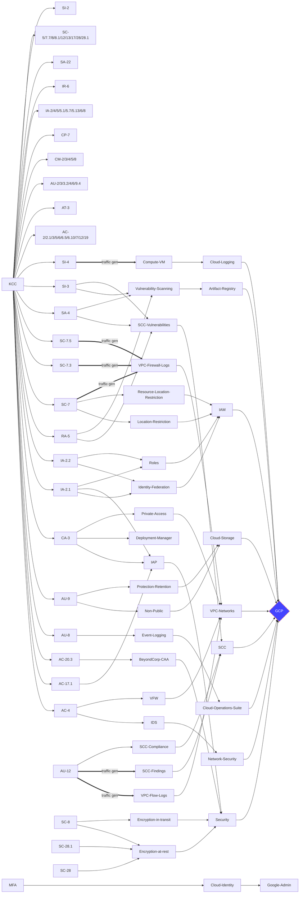
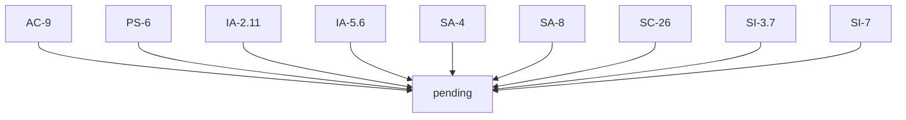
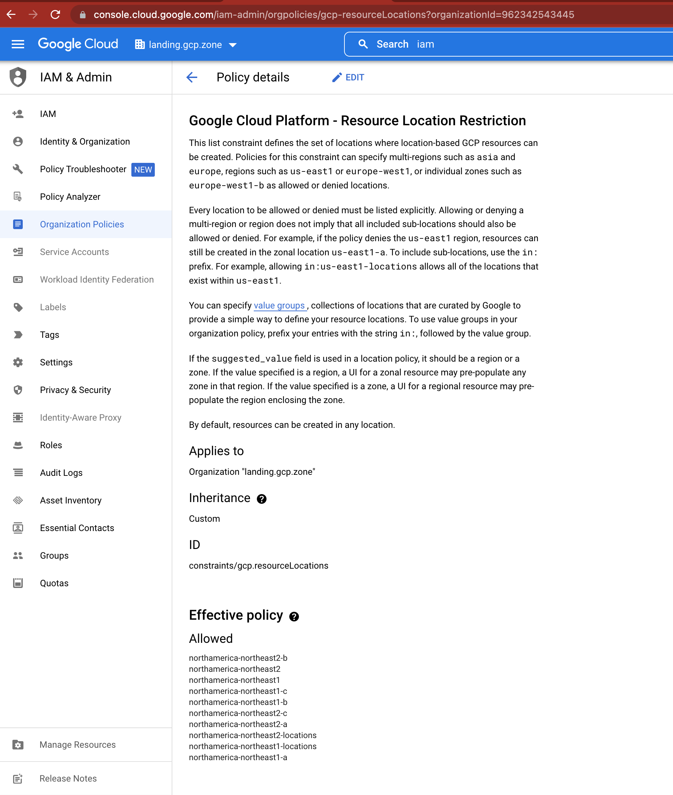

# Security Controls Mappings


WARNING - use the following up to date security controls document in the PBMM repo

See corresponding Terraform based PBMM security controls Mappings - https://github.com/GoogleCloudPlatform/pbmm-on-gcp-onboarding/blob/main/docs/google-cloud-security-controls.md


# deprecated
The purpose of this document is to detail the relationship/coverage/evidence between ITSG-33 security controls and corresponding GCP services.

[ITSG-33 Security Controls Grid](#security-controls) | [Google Cloud Platform Services - Mapped to Controls](#google-cloud-services)

## Controls Coverage
Use the new "All Products" page for a list of Google Cloud Services https://console.cloud.google.com/products


### Pending

[mermaid - diagrams as code](https://mermaid-js.github.io/mermaid/#/flowchart?id=graph)


## Security Controls
SA-4 marked KEY

Category / Count | Controls
 --- | ---  
AC _1_ | _AC-1_ 
SC _1_ | [SC-7](#6260sc-7boundary-protection)

### Mandatory 10 Security Controls 
```
20220921
10 security controls of high priority
AC-2 AC-17 CA-3 CM-7.5 IA-7 IR-4 IR-6 IR-9 SC-8 SC-12

List of above not in 31 subset below
AC-17 CM-7.5 IA-7 IR-4 (see existing IR-6) IR-9 SC-8 SC-12

List of above in TB subset below
SC-8. SC-12

List of above not in larger already evidenced list
- none

```


### Security Controls  - 31 subset
20220913: 31 subset of interest
```
5 AC-2 AC-3 AC-4 AC-6 AC-12
1 AT-3
4 AU-2 AU-3 AU-6 AU-13
1 CA-3
1 CM-2
2 IA-2 IA-5
1 IR-6
1 MP-2
2 PE-3 PE-19
1 PS-6
1 RA-5
2 SA-4 SA-8
5 SC-7 SC-13 SC-26 SC-28 SC-101
4 SI-2 SI-3 SI-4 SI-7
```

### Optional Security Controls - TB subset
There is overalap bewteen the 31 subset and the TB subset
TB specific:
```
AC-2.1/5/6.5/6.10/7/9/19/20.3
AU-8/9/9.4/12
CM-3/4/5/8
IA-2.1/2.2/2.11/4/5.1/5.6/5.7/5.13/6/8
SA-22
SC-5/7.5/8/8.1/12(p3?)/17/28/28.1
SI-3.7
```

### Extra security controls - via inheritance
Extras we have
```
AC-2.1
AC-5
AC-6.5
AC-6.10
AC-7
AC-17.1
CM-7.5
```


# Individual Security Controls

## legend
pk,control id,phase 1,phase 2, service name, service link, service evidence,code link, future, control link, title 

## 0020,AC-2,,,,,,,,,Account Management
P1 : (P1 is the priority number in the ITSG-33 document)
### GCP Services Coverage:
screen cap reference

### Definition: cloud identity super-admin root account with additional least-priv subaccounts

### Services: MFA, IAM roles/accounts - IAM Roles (org admin, billing admin, project admin, project billing admin), Identity Super Admin Role, ssh access, MFA on the identity account with optional AD federation

See Identity Onboarding and Federation options at https://cloud.google.com/architecture/landing-zones/decide-how-to-onboard-identities

Admin Group Account, Password Policy, Access Logs Event Logging, MFA, IAM Essential Contacts

### Violations
- L: Cloud Audit Logging should be configured properly across all services and all users from a project
- H: Cloud Storage buckets should not be anonymously or publicly accessible
- H: Datasets should not be publicly accessible by anyone on the internet


## 6260,SC-7,,,,,,,,,Boundary Protection
[P1](https://cyber.gc.ca/en/guidance/annex-3a-security-control-catalogue-itsg-33) : 

### Definition:
### GCP Services Coverage:
 - [IAM - Organization Policies - Resource Location Restriction](#iam---organization-policies---resource-location-restriction)
### Code Coverage
 - [05-data-location](#05-data-location)
### Services


## GCP Service to Controls Mappings : 1:N
# Google Cloud Services
Use the new "All Products" page for a list of Google Cloud Services https://console.cloud.google.com/products

## IAM
### IAM - Organization Policies
#### IAM - Organization Policies - Resource Location Restriction
##### Evidence
 - Security Controls covered: [SC-7](#6260sc-7boundary-protection)
 - Code: [05-data-location](#05-data-location)

###### Screencap
- 
###### CLI
```
prep
export PROJECT_ID=pubsec-declarative-tk-lgz
export ORG_ID=$(gcloud projects get-ancestors $PROJECT_ID --format='get(id)' | tail -1)

verify org level
gcloud beta resource-manager org-policies list --organization $ORG_ID
CONSTRAINT: constraints/gcp.resourceLocations
LIST_POLICY: SET
BOOLEAN_POLICY: -

Verify specific policy
gcloud beta resource-manager org-policies describe gcp.resourceLocations --organization $ORG_ID

constraint: constraints/gcp.resourceLocations
etag: CMe_i5gGEKDVkL8D
listPolicy:
  allowedValues:
  - in:northamerica-northeast2-locations
  - in:northamerica-northeast1-locations
updateTime: '2022-08-22T01:45:43.937700Z'
```


##### Details
- see https://cloud.google.com/resource-manager/docs/organization-policy/defining-locations

## Controls to Code Mappings: M:N
### SC-7
- [05-data-location](#05-data-location)

## Code To Controls Mappings : 1:N
### environments
#### common
##### guardrails-policies
###### 05-data-location
- Artifact: [https://github.com/GoogleCloudPlatform/pubsec-declarative-toolkit/tree/main/solutions/landing-zone/environments/common/guardrails-policies/05-data-location](https://github.com/GoogleCloudPlatform/pubsec-declarative-toolkit/blob/main/solutions/landing-zone/environments/common/guardrails-policies/05-data-location/constraint.yaml#L25)
- Control: [SC-7](#6260sc-7boundary-protection)


## Guardrails Subset
see - https://github.com/canada-ca/cloud-guardrails/tree/master/EN


# Links
  - detailed ITSG-33 (2014) https://cyber.gc.ca/en/guidance/annex-2-information-system-security-risk-management-activities-itsg-33
  - summary ITSG-33 https://cyber.gc.ca/en/guidance/annex-4-identification-control-elements-security-controls-itsg-41
  - AU-2 AU-3 AU-4 AU-5 AU-16 via cloud logging fedramp compliance https://cloud.google.com/blog/products/identity-security/5-must-know-security-and-compliance-features-in-cloud-logging
  - CSO https://www.tpsgc-pwgsc.gc.ca/esc-src/msc-csm/xa-eng.html
# Appendix
    
## Traffic Generation
