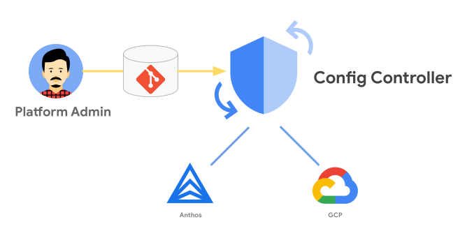

# KRM Landing Zone

This is a re-implementation of [pbmm-on-gcp-onboarding](https://github.com/GoogleCloudPlatform/pbmm-on-gcp-onboarding) Landing Zone using KRM.

The goal of this repo is to have parity with pbmm-on-gcp-onboarding repository using [Config Controller](https://cloud.google.com/anthos-config-management/docs/concepts/config-controller-overview) to deploy and manage the infrastructure.

Config Controller is a hosted service to provision and orchestrate Anthos and Google Cloud resources. It offers an API endpoint that can provision, actuate, and orchestrate Google Cloud resources as part of Anthos Config Management.



## Organization

This Landing Zone will create an initial 3 environments.

Creates 3 Environments

- Common
- Non-prod
- Prod

These configurations for these environments is contained in the environments directory (`environments/`) of this package.

The following folder structure and projects will be deployed.

*Assume folder unless identified as a project*

```plaintext
Infrastructure:
  - Networking:
      - ProdNetworking
        - Production Network Project
      - NonProdNetworking
        - Non Production Network Project
  - SharedInfrastructure
Sandbox
Workloads:
  - Prod
  - UAT
  - DEV
Audit and Security:
  - Audit
    - Guardrails Project
    - Audit Bunker Project
  - Security
    - Common Network Perimeter Project
Automation
Shared Services
```

The following resources will be deployed.

### Common

| Resource | Name | Purpose | Status | Location |
| ---- | ---- | ---- | --- | -- |
| Access Context Manager | | | Work In Progress | `environments/common/vpc-service-controls`
| Core Audit Bunker | | | Available | `environments/common/audit` |
| Core Folders | | | Available | `environments/common/hierarchy.yaml` |
| Core IAM | | | Available | `environments/common/iam` |
| Core Org Custom Roles | | File for Custom Org Roles | Available | `environments/common/iam` |
| Core Org Policy | | Default Org Policies | Available | `environments/common/policies` |
| Guardrails | | | Available | `environments/common/guardrails-policies` |
| Base Network Perimeter | | | Available | `environments/common/network` |
| Network Management Perimeter | | | Available | `environments/common/network` |

### Non-Prod

| Resource | Name | Purpose | Status | Location |
| ---- | ---- | ---- | --- | -- |
| VPC Service Control | | | Available | `environments/nonprod/shared-vpc` |
| VPN Controllers | |  | Not Available | `environments/nonprod/network` |
| Network Host Project | | | Available | `environments/nonprod/network` |
| Firewall | | | Available | `environments/nonprod/firewall` |

### Prod

| Resource | Name | Purpose | Status | Location |
| ---- | ---- | ---- | --- | -- |
| Network Host Project | | | Available | `environments/nonprod/network` |
| VPC Service Controls | | | Available | `environments/nonprod/vpc-service-controls` |
| Network Perimeter Project | | | Available | `environments/nonprod/network` |
| Network HA Perimeter | | | Available | `environments/nonprod/network` |
| Net Private Perimeter | | | Available | `environments/nonprod/network` |
| Firewall | | | Available | `environments/nonprod/firewall` |
| Network Private Perimeter Firewall | | | Available | `environments/nonprod/firewall` |
| Network Public Perimeter Firewall | | | Available | `environments/nonprod/firewall` |

## Setup

To deploy this Landing Zone you will first need to create a Bootstrap project with a Config Controller instance.

### 0. Set Default Logging Storage Location

 This command will ensure that the default logging buckets that are generated with a new project (organization wide) are set to the selected region instead of the default location `global`.

The variable PROJECT_ID is derived from your currently set project via a previously run and authenticated...

```shell
gcloud config set project <your bootstrap project id>
```

Run the following code block

 ```shell

export PROJECT_ID=$(gcloud config list --format 'value(core.project)')
export REGION=northamerica-northeast1
export ORG_ID=$(gcloud projects get-ancestors $PROJECT_ID --format='get(id)' | tail -1)
export EMAIL=$(gcloud config list --format json|jq .core.account | sed 's/"//g')
gcloud organizations add-iam-policy-binding "${ORG_ID}" --member "user:${EMAIL}" --role roles/logging.admin
gcloud alpha logging settings update --organization=$ORG_ID --storage-location=$REGION
 ```

### 1. Deploy Bootstrap

  Note: You may use the [advanced install](/docs/advanced-install.md) as an alternative to using arete to create the CC project, VPC, Subnet, deploy the CC cluster.
  This bootstrap assume you have a [Config Controller](https://cloud.google.com/anthos-config-management/docs/concepts/config-controller-overview) instance provisioned already. If you do not you can follow either the [quickstart](https://cloud.google.com/anthos-config-management/docs/concepts/config-controller-overview) guide or the [detailed install guide](https://github.com/GoogleCloudPlatform/pubsec-declarative-toolkit/blob/main/docs/advanced-install.md) for advanced users (this is recommended for experienced users).

  This Solution will require the Config Controller instance to have the following permissions. Note: ORD_ID will already be set in [step 0](#0-set-default-logging-storage-location) above - if not run the following line first.

  ```shell
  export ORG_ID=your-org-id
  ```

  Run

  ```shell
  export SA_EMAIL="$(kubectl get ConfigConnectorContext -n config-control -o jsonpath='{.items[0].spec.googleServiceAccount}' 2> /dev/null)"
  gcloud organizations add-iam-policy-binding "${ORG_ID}" --member "serviceAccount:${SA_EMAIL}" --role "roles/resourcemanager.folderAdmin"
  gcloud organizations add-iam-policy-binding "${ORG_ID}" --member "serviceAccount:${SA_EMAIL}" --role "roles/resourcemanager.projectCreator"
  gcloud organizations add-iam-policy-binding "${ORG_ID}" --member "serviceAccount:${SA_EMAIL}" --role "roles/resourcemanager.projectDeleter"
  gcloud organizations add-iam-policy-binding "${ORG_ID}" --member "serviceAccount:${SA_EMAIL}" --role "roles/iam.securityAdmin"
  gcloud organizations add-iam-policy-binding "${ORG_ID}" --member "serviceAccount:${SA_EMAIL}" --role "roles/orgpolicy.policyAdmin"
  gcloud organizations add-iam-policy-binding "${ORG_ID}" --member "serviceAccount:${SA_EMAIL}" --role "roles/serviceusage.serviceUsageConsumer"
  gcloud organizations add-iam-policy-binding "${ORG_ID}" --member "serviceAccount:${SA_EMAIL}" --role "roles/billing.user"
  gcloud organizations add-iam-policy-binding "${ORG_ID}" --member "serviceAccount:${SA_EMAIL}" --role roles/accesscontextmanager.policyAdmin
  gcloud organizations add-iam-policy-binding "${ORG_ID}" --member "serviceAccount:${SA_EMAIL}" --role roles/compute.xpnAdmin
  gcloud organizations add-iam-policy-binding "${ORG_ID}" --member "serviceAccount:${SA_EMAIL}" --role roles/iam.serviceAccountAdmin
  gcloud organizations add-iam-policy-binding "${ORG_ID}" --member "serviceAccount:${SA_EMAIL}" --role roles/serviceusage.serviceUsageConsumer
  gcloud organizations add-iam-policy-binding "${ORG_ID}" --member "serviceAccount:${SA_EMAIL}" --role roles/logging.admin
  ```

  **Note**: You will also need to give the Service Account ($SA_EMAIL) the Billing Account User role on your billing account in order to allow it to associate billing IDs to the Projects that will be created. You can do that by following the steps in this [guide](https://cloud.google.com/billing/docs/how-to/billing-access#update-cloud-billing-permissions). If this is not granted projects will not be able to be provisioned.

  Deploying without Billing Account User role is possible but will require a user who does to manually add the billing account to the project. To do this you will need to remove the Billing Section of any deployed project (projects can be found in the following directories `common/projects`,`nonprod/projects`, `prod/projects`). Once the project is created the user with the Billing User will be able to add the billing id to the generated projects in the [manage billing page](https://console.cloud.google.com/billing).

### 2. Fetch the package

  ```shell
  kpt pkg get https://github.com/GoogleCloudPlatform/pubsec-declarative-toolkit.git/solutions/landing-zone landing-zone
  ```

 Details: <https://kpt.dev/reference/cli/pkg/get/>

### 3. Set Organization Hierarchy

 Modify `environments/common/hierarchy.yaml` if required.

### 4. Customize Package

 Edit [setters.yaml](https://github.com/GoogleCloudPlatform/pubsec-declarative-toolkit/blob/main/solutions/landing-zone/setters.yaml) with the relevant information.

 Emails used for groups should be exist in iam/groups before running the script.

 Project Number and Project ID for the management project will be for the project that the config controller instance runs in.

  | Name | Default | Description |
  | --- | --- | --- |
  | billing-id | "0123456-0123456-0123456" | Billing ID used with created projects |
  | org-id | "01234567890" | Target Organization ID |
  | management-project-id | management-project-**12345**  | ID of the Project where the Config Controller instance is located |
  | management-project-number | "0123456789012" |  [Number](https://cloud.google.com/resource-manager/docs/creating-managing-projects#identifying_projects) of the Project where the Config Controller instance is location |
  | net-host-prj-nonprod-id | net-host-prj-nonprod-**12345** | ID to be used for the Non-Prod Network Host Project |
  | net-host-prj-prod-id | net-host-prj-prod-**12345** | ID to be used for the Prod Network Host Project |
  | net-perimeter-prj-common-id | net-per-prj-common-**12345** | ID to be used for the Common Network Perimeter Host Project |
  | audit-prj-id | audit-prj-id-**12345** | ID to be used for the Audit Project |
  | guardrails-project-id | guardrails-project-**12345** | ID to be used for the Guardrails Project |
  | audit-viewer | group@yourorg.com | Group email to get audit viewer permissions |
  | log-writer | group@yourorg.com | Group email to get log writer permissions |
  | log-reader | group@yourorg.com | Group email to get log reader permissions |
  | organization-viewer| group@yourorg.com | Group email to get org viewer permissions |

 **Note on Project IDs**: All IDs should be universally unique, Must be 6 to 30 characters in length, can only contain lowercase letters, numbers, and hyphens. Must start with a letter. Cannot end with a hyphen. Cannot be in use or previously used; this includes deleted projects. Cannot contain restricted strings, such as google and ssl.  Replace the **12345** with an appropriate distinct postfix - like your org/domain name first char in reverse.

## Deployment

 This solution can be deployed in a few different ways depending on the behavior you want.
    - kpt
    - GitOps
      - [Git](#git)
      - [OCI](#oci)

 Deploying through `kpt` is a more traditional push approach to deploying the infrastructure. This will deploy the infrastructure resources into the target cluster similar to how `kubectl` operates. Some of the deployment advantages `kpt` offers is the ability to use functions live `render` to populate variables in the configuration and `gatekeeper` which allows us to validate policy before deployment.

 When deploying resources `kpt` will wait for all resources to deploy before finishing, `kpt` also provides annotations such as [depends-on](https://kpt.dev/reference/annotations/depends-on/) that allow us to order the deployment of resources.

 GitOps allows us to connect our cluster to a "source of truth" and deploy from that. To do this we use [Anthos Config Management](https://cloud.google.com/anthos/config-management), which is pre-installed in Config Controller, and this allows us to target either a [Git Repository](https://cloud.google.com/anthos-config-management/docs/concepts/configs) or [OCI Artifact](https://cloud.google.com/anthos-config-management/docs/how-to/publish-config-registry) (Container).

 The benefit to this method is we now have an additional reconciliation process to ensure the deployed state matches our desired state or "source of truth". This also allows for improved automation and removes the need to run `kpt live apply` to deploy resources.

### kpt

 Before deploying with `kpt` you will need to add `constraints.yaml` to the `.krmignore` file. This is due to needing to have the `constraintstemplate` resources deployed into the instance before the policy `constraint` can be deployed. Once the `constrainttemplates` have been deployed you can remove `constraints.yaml` from the `.krmignore` file and redeploy. This is not needed with either gitops deployment options.

 Before running the `kpt` commands for the first time you will need to initialize the `kpt` package locally. You will only need to do this once after you initially get the `kpt` package

 The following commands assume the `landing-zone` package is in your currently directory. If you are in the `landing-zone` directory you can remove omit the `landing-zone` argument from the commands.

  ```shell
    kpt live init landing-zone --namespace config-control
  ```

  ```shell
    kpt fn render landing-zone
    kpt live apply landing-zone --reconcile-timeout=2m --output=table
  ```

 The section around billing that looks like the following and can either be commented out or deleted.

  ```shell
    billingAccountRef:
        # Replace "${BILLING_ACCOUNT_ID?}" with the numeric ID for your billing account
        external: "${BILLING_ACCOUNT_ID?}" # kpt-set: ${billing-id}
  ```

 This will cause the project to spin up with no attached billing id and any service that requires billing to be enabled will pause deployment until billing is enabled. Billing can be added by a user with Billing User permission in the Billing UI. If you do not remove this section the project will fail to create.

 You can view the status of any deployed object by running `kubectl get gcp` when connected to the Config Controller instance. If an object is pending or is displaying an error you can investigate by copying the name of the object and running the describe command.

 For example `kubectl describe storagebucket.storage.cnrm.cloud.google.com/audit-sink-audit-prj-12345`.

## GitOps

### Git

   Deploy Infrastructure via GitOps using Anthos Config Management

   To start you will need a git repo, for this guide we will be using Cloud Repositories but you could easily use Gitlab, or Github. The instructions have been modified from the config controller setup guide located in [Manage Google Cloud resources with Config Controller](https://cloud.google.com/anthos-config-management/docs/how-to/config-controller-setup#manage-resources) and [Setup GitOps](https://cloud.google.com/anthos-config-management/docs/how-to/config-controller-setup#set_up_gitops).

   Skip this step if not using Cloud Repositories.

#### 1a. Create Source Control Service

   ```yaml
          # service.yaml

          apiVersion: serviceusage.cnrm.cloud.google.com/v1beta1
          kind: Service
          metadata:
            name: sourcerepo.googleapis.com
            namespace: config-control
   ```

#### 1b. Apply the service Manifest

   ```shell
          kubectl apply -f service.yaml
          kubectl wait -f service.yaml --for=condition=Ready
   ```

#### 1c. Create the Repo YAML

   ```yaml
          apiVersion: sourcerepo.cnrm.cloud.google.com/v1beta1
          kind: SourceRepoRepository
          metadata:
            name: my-lz-repo
            namespace: config-control
   ```

#### 1d. Apply the repo Manifest

   ```shell
          kubectl apply -f repo.yaml
   ```

   Now that we have a git repo set up we can configure the config controller instance to target it in order to deploy our infrastructure.

#### 2. Create a Service Account and give it permissions to access the repo

   ```yaml
          # gitops-iam.yaml

          apiVersion: iam.cnrm.cloud.google.com/v1beta1
          kind: IAMServiceAccount
          metadata:
            name: config-sync-sa
            namespace: config-control
          spec:
            displayName: ConfigSync
          ---

          apiVersion: iam.cnrm.cloud.google.com/v1beta1
          kind: IAMPolicyMember
          metadata:
            name: config-sync-wi
            namespace: config-control
          spec:
            member: serviceAccount:${PROJECT_ID}.svc.id.goog[config-management-system/root-reconciler]
            role: roles/iam.workloadIdentityUser
            resourceRef:
              apiVersion: iam.cnrm.cloud.google.com/v1beta1
              kind: IAMServiceAccount
              name: config-sync-sa

          ---

          apiVersion: iam.cnrm.cloud.google.com/v1beta1
          kind: IAMPolicyMember
          metadata:
            name: allow-configsync-sa-read-csr
            namespace: config-control
          spec:
            member: serviceAccount:config-sync-sa@${PROJECT_ID}.iam.gserviceaccount.com
            role: roles/source.reader
            resourceRef:
              apiVersion: resourcemanager.cnrm.cloud.google.com/v1beta1
              kind: Project
              external: projects/PROJECT_ID
   ```

#### 3. Deploy the manifests

   ```shell
          kubectl apply -f gitops-iam.yaml
   ```

#### 4. Config the config sync instance

   ```yaml
          # root-sync.yaml

          apiVersion: configsync.gke.io/v1beta1
          kind: RootSync
          metadata:
            name: root-sync
            namespace: config-management-system
          spec:
            sourceFormat: unstructured
            git:
              repo: https://source.developers.google.com/p/${PROJECT_ID}/r/REPO_NAME
              branch: REPO_BRANCH
              dir: REPO_PATH
              auth: gcpserviceaccount
              gcpServiceAccountEmail: config-sync-sa@${PROJECT_ID}.iam.gserviceaccount.com
   ```

#### 5. Deploy the Config Sync Manifest

   ```shell
          kubectl apply -f root-sync.yaml
          kubectl wait --for condition=established --timeout=10s crd/rootsyncs.configsync.gke.io
   ```

#### 6. Push Configs to Git

   ```shell
          gcloud source repos clone my-lz-repo
          cd my-lz-repo
   ```

   Modify the `setters.yaml` file and apply the changes.

   ```shell
          kpt fn render
   ```

   ```shell
          git add .
          git commit -m "Add Guardrails solution"
          git push --set-upstream origin main
   ```

### OCI

   Before we deploy via OCI we have a few things we'll need to do to prepare our environment.

   First we'll need to create an artifact registry to store our OCI artifacts.

   Let's set some environment variables to start

   ```shell
      export PROJECT_ID=<PROJECT_ID>
      export AR_REPO_NAME=<REPO_NAME>
      export GSA_NAME="config-management-oci"
   ```

   Enable Artifact Registry

   ```shell
      gcloud services enable artifactregistry.googleapis.com \
      --project=${PROJECT_ID}
   ```

   Create a new repository

   ```shell
      gcloud artifacts repositories create ${AR_REPO_NAME} \
      --repository-format=docker \
      --location=northamerica-northeast1 \
      --description="Config Sync OCI repo" \
      --project=${PROJECT_ID}
   ```

   Create a Service Account for Config Management to Access the Artifact Repository.

   ```shell
      gcloud iam service-accounts create $GSA_NAME --project=${PROJECT_ID}
   ```

   Assign it the read permissions

   ```shell
      gcloud artifacts repositories add-iam-policy-binding ${AR_REPO_NAME} \
      --member "serviceAccount:${GSA_NAME}@${PROJECT_ID}.iam.gserviceaccount.com" \
      --location northamerica-northeast1 \
      --role "roles/artifactregistry.reader"
   ```

   Allow the SA to be accessed by the Root Sync Service account.

   ```shell
      gcloud iam service-accounts add-iam-policy-binding ${GSA_NAME}@${PROJECT_ID}.iam.gserviceaccount.com \
      --role roles/iam.workloadIdentityUser \
      --member "serviceAccount:${PROJECT_ID}.svc.id.goog[config-management-system/root-reconciler]"
   ```

#### Push Config Image to the repository

##### Install crane and login to Artifact Registry

  ```shell

      go install github.com/google/go-containerregistry/cmd/crane@latest
      crane auth login northamerica-northeast1-docker.pkg.dev  -u oauth2accesstoken -p "$(gcloud auth print-access-token)"

  ```

#### Render the Configs

   At this point we'll want to update our `setters.yaml` with the appropriate values and render the solution configurations using `kpt`.

   ```shell

      kpt fn render landing-zone

   ```

   Once that has completed we can build our OCI Artifact with the crane CLI.

   ```shell
      crane append -f <(tar -f - -c .) -t northamerica-northeast1-docker.pkg.dev/$PROJECT_ID/${AR_REPO_NAME}/landing-zone:v1
   ```

   Now that our Landing Zone Artifact has been built we can create a `RootSync` object which will tell the Config Management service where to find the Configs for deployment.

   ```yaml

      cat <<EOF>> lz-oci.yaml
      apiVersion: configsync.gke.io/v1beta1
      kind: RootSync
      metadata:
        name: root-sync
        namespace: config-management-system
      spec:
        sourceFormat: unstructured
        sourceType: oci
        oci:
          image: northamerica-northeast1-docker.pkg.dev/$PROJECT_ID/${AR_REPO_NAME}/landing-zone:v1
          dir: environments
          auth: gcpserviceaccount
          gcpServiceAccountEmail: ${GSA_NAME}@${PROJECT_ID}.iam.gserviceaccount.com
      EOF

   ```

   Apply it to the target cluster.

   ```shell

      kubectl apply -f lz-oci.yaml

   ```

#### Clean Up

   Follow the below steps to delete the provisioned infrastructure and Config Controller instances.

   If you want the deployed resources to live on and just destroy the Config Controller instance you can do so by running `gcloud anthos config controller instance-name --location instance-region`. This will remove the config controller instances but leave the resources it deployed untouched.

   To reacquire the resources you will need to redeploy a new instance and deploy the same configs to it. Config Controller should reattach to the previously deployed instances and start managing them again.

#### kpt

   First run either

   ```shell

      kpt live destroy

   ```

   or

   ```shell

      kubectl delete gcp --all

   ```

   Finally delete the Config Controller instance

   ```shell

      gcloud anthos config controller instance-name --location instance-region

   ```

#### OCI

   First delete the Rootsync deployment. This will prevent the resources from self-healing.

   ```shell

      kubectl delete rootsync landing-zone -n config-management-system

   ```

   Now we can delete our KCC resources from the Config Controller instance.

   ```shell

      kubectl delete gcp --all -n config-control

   ```

   Once the resources have been deleted you can delete the config controller instance .

   If you have forgotten the name of the instance you can run `gcloud config controller list` to reveal the instances in your project.

   ```shell

      gcloud anthos config controller delete instance-name --location instance-region

   ```

## Cloud Deploy (future)
