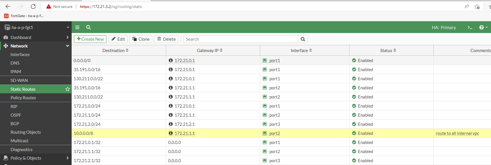

# POC setup
## GCP
1. create perimeter project
1. create role and service account for the fortigates (create role and grant iam at org level)

    ```bash
    
    export SA_NAME=fortigatesdn-sa
    
    gcloud iam roles create FortigateSdnReader --project=$GCP_PROJECT_ID \
      --title="FortiGate SDN Connector Role (read-only)" \
      --permissions="compute.zones.list,compute.instances.list,container.clusters.list,container.nodes.list,container.pods.list,container.services.list"

    echo "Creating new service account (FortiGate SDN Connector)..."
    gcloud iam service-accounts create $SA_NAME \
      --display-name="FortiGate SDN Connector"

    echo "Granting $SA_NAME service account access to project $GCP_PROJECT_ID..."
    gcloud projects add-iam-policy-binding $GCP_PROJECT_ID \
      --member="serviceAccount:$SA_NAME@$GCP_PROJECT_ID.iam.gserviceaccount.com" \
      --role="projects/$GCP_PROJECT_ID/roles/FortigateSdnReader"

    SRV_ACC=$(gcloud projects get-iam-policy $GCP_PROJECT_ID --flatten="bindings[].members" --filter="bindings.role:FortigateSdnReader" --format="value(bindings.members)")
    echo $SRV_ACC | grep fortigatesdn && echo "Service account created succesfully" || echo "Something went wrong"
    
    # create json key
    gcloud iam service-accounts keys create $SA_NAME.json --iam-account  $SA_NAME@${GCP_PROJECT_ID}.iam.gserviceaccount.com
    ```

1. enable compute engine api
1. add org policy exception for vm with public ip AND serial console access

## Fortigate
1. add route for ip range of all peered vpc (ex. : 10.0.0.0/8) and define the internal gateway ip (ex. : 172.21.1.1) as the gateway


1. add firewall policy to allow traffic


1. update time zone to be gmt-5


