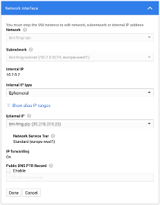
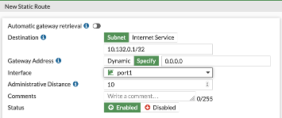
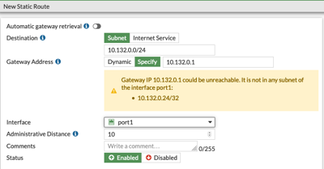
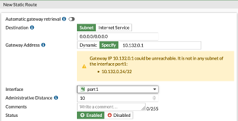

# Configuring static routing in FortiGate VM in Google Cloud

By default, Google Compute VM instances network configuration use single-host (/32 net mask) subnets regardless of the subnet CIDR configuration. The internal IP address and routes are assigned to VM using DHCP, but in some cases you might need to configure addresses and routing statically in FortiGate. This document describes configuration of static IP and routing for such requirements.

Note that the way how subnets work can be affected on a per-VM basis during VM deployment using the MULTI_IP_SUBNET guest OS feature described at the end of this article. Some Fortinet templates - namely all the deployment manager templates in this repository - make use of this feature by default, so before you continue make sure you know if your deployment uses the MULTI_IP_SUBNET or the standard networking scheme.

## Changing DHCP to static network configuration

### Assign static internal IP in the Google Cloud

By default a VM instance will be assigned an ephemeral internal IP address every time it is started.  Before you use static IP address in FortiGate configuration, you must make sure Google Compute will always use the same IP address.

1.	Open the VM instance details page for the FortiGate and click Edit button at the top
2.	Scroll down to the Network interfaces section and click the pencil icon to edit the properties of a network interface (you will need to repeat this and following steps for each network interface with static IP separately)
3.	Verify the current setting of Internal IP type and change it to Static to reserve the currently used internal IP (this option is available for currently running instances).

You will be asked to provide a name for the reserved internal IP.

Changing NIC properties of a stopped instance will allow you to assign a custom internal IP address.

### Changing to static addressing in FortiGate configuration - routing

*NOTE: it is important to follow the proper order of actions. Changing interface settings before configuring routing will result in lost communication with FortiGate, which can be recovered using CLI over serial console.*

1.	Connect to your FortiGate instance management GUI. Note: the same configuration can be changed using CLI - check FortiGate documentation for details.
2.	Use the Network Dashboard to find information about all currently configured routes.
3.	Open Network/Static Routes and configure the following entries:
    1.	to the first IP in the subnet with netmask 255.255.255.255 with gateway 0.0.0.0 and proper interface
 

    1.	to the local subnet CIDR via the first ip address in that subnet. You will be presented with a warning about Gateway IP not being reachable via the interface (this problem was mitigated with the previous route entry):
    

    1.	If you are configuring port1 interface which is typically used for egress traffic to the Internet, metadata service and Google API, you also need to configure the default route using gateway settings as in previous step:
    

### Changing to static addressing in FortiGate - interface

Open Network / Interfaces and double-click the interface you want to change. In Addressing mode section switch to Manual. The proper IP address with 255.255.255.255 netmask will be automatically filled in.

## Load Balancer routes

If your FortiGate is accepting connections via a load balancer, you will have to additionally configure routes to health probes IP ranges *on each interface receiving traffic* to prevent health probes from being blocked by the RPF (Reverse Path Forwarding) check. The ranges (different for different types of load balancers) are documented by Google and for the Internal Load Balancer are:
-	35.191.0.0/16
-	130.211.0.0/22

The ranges used by External Network Load Balancer are already covered by the 0.0.0.0/0 route on the external interface.

See also: [Using MULTI_IP_SUBNET feature](multi_ip_subnet.md)
